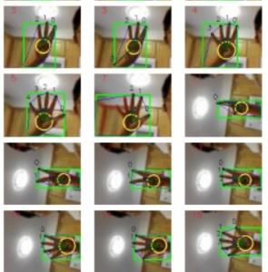

# 关于Andrord 引入基于视觉手势识别方案的调研

# 一、前言

手势识别从使用硬件设备上进行分类可以分为：**基于穿戴设备（手套）的手势识别和基于摄像头（视觉）方法的手势识别**。基于数据手套的手势识别技术具有数据精确， 识别率高，抗干扰性能好等优点，但是基于数据手套的识别技术存在设备昂贵，识别过程中必须戴上数据手套等缺点。基于摄像头的手势识别，运用计算机视觉技术，不需要佩戴昂贵的设备，人机交互过程更加自然，**基于摄像头的手势识别技术已经成为手势识别的主流**。[1]

基于视觉手势识别是指对视频采集设备拍摄到的包含手势的图像序列，通过计算机视觉技术进行处理 ，进而对手势加以识别，其**基本流程**如下图所示 。[2]


基于视觉的手势识别技术可以进一步分为**静态手势识别和动态手势识别**，**静态手势被定义为一段时间内在空间中的定向和位置均没有任何移动的手**，静态手势识别主要是**基于单帧图像中对单只手在单个时间点上的形状、方向、轮廓进行识别**。其优势是手处于静止不动状态，姿态、形状、位置等信息不随时间发生变化，容易实现且识别效率较高；但静态手势也有其自身的局限性，比如反映的信息量较少，不符合人手可以随意运动的特性，因此无法应用于复杂的场景中。**动态手势识别**则是在**一段时间内识别手势姿态序列的变化**，这个序列参数在空间中对应的是一条轨迹。**连续的动态手势是由一帧一帧的静态手势所组成的**，即**静态手势就是动态手势的一种特殊状态**。动态手势的优势是通过不同手势的灵活变化可以传递更多信息，在人机交互领域有广泛的应用。[2]

本文将对Andrord 引入基于视觉动态手势识别方案进行调研。


# 二、如何在Andrord中引入基于视觉的手势识别

## 2.1 基于OpenCV的传统计算机视觉方案

OpenCV 传统手势识别方法可以按照 **技术实现逻辑** 分为两类：**基于规则的几何特征方法** 和 **基于机器学习的特征工程方法**。

|                     | **基于规则的几何特征方法**                                   | **基于机器学习的特征工程方法**                               |
| ------------------- | ------------------------------------------------------------ | ------------------------------------------------------------ |
| **分类核心**        | 依赖人工设计的**几何规则与图像预处理**                       | 依赖人工设计的**特征提取器 + 机器学习分类器**                |
| **核心原理**        | **通过肤色分割、轮廓分析等提取几何特征，结合规则判断手势**   | 通过 **人工设计特征提取器** （如 Haar 特征、HOG 特征）提取手部区域的特征向量，再利用机器学习分类器（如 SVM、Adaboost）进行训练和识别。 |
| **包含方法**        | - 肤色分割 + 轮廓检测 - 轮廓几何形状匹配                     | - Haar Cascade 分类器 - HOG + SVM                            |
| **数据需求**        | **无需标注数据**（纯规则驱动）                               | **需要大量标注样本**（正负样本或 ROI 标签）                  |
| **典型步骤**        | 1. 图像预处理（阈值分割、形态学操作） 2. 轮廓提取 3. 几何特征计算（面积、指尖数等） 4. 规则匹配 | 1. 数据标注（手势 ROI 或边界框） 2. 特征提取（Haar/HOG） 3. 分类器训练（Adaboost/SVM） 4. 特征匹配与分类 |
| **优点**            | - 实现简单，无需训练 - 计算轻量，适合低端设备 - 实时性高     | - 可支持更多手势类型（相比纯规则方法） - 泛化能力略强 - 可通过训练优化精度 |
| **缺点**            | - 仅适用于简单静态手势（如指尖数明确） - 受光照、背景干扰大 - 抗遮挡能力差 | - 需要人工标注数据，训练流程繁琐 - 特征设计依赖经验，复杂手势效果差 - 计算量高于纯规则方法 |
| **手势复杂度支持**  | **简单静态手势**（如点赞、数字手势）                         | **中等复杂度静态手势**（如多手指轮廓区分）                   |
| **典型应用场景**    | - 固定背景下的家电控制手势 - 低成本原型开发                  | - 固定视角下的多手势分类（如 “石头剪刀布”） - 对精度要求中等的场景 |
| **典型工具 / 函数** | `findContours`、`contourArea`、肤色阈值函数                  | `CascadeClassifier`、`HOGDescriptor`                         |

- **输出形式**：通常是检测出手部区域，或给出简单的手势标签（如果使用分类器）。无关键点。
- **Android 部署**：利用 OpenCV Android SDK，可在手机端调用 `CascadeClassifier`、`findContours` 等函数。也可使用 OpenCV DNN 模块加载 TFLite/ONNX 模型[opencv.org](https://opencv.org/blog/opencv-4-10-0/#:~:text=,9%2B and OpenVINO 2024 support)。

注：OpenCV 4.10+ 的 DNN 模块已支持读取 TFLite/ONNX 模型，可用于在 Android 上运行任意已训练模型。

**使用OpenCV是实现手势识别的核心流程**：

1. **图像预处理**：使用 OpenCV 的高斯滤波、肤色分割（HSV 颜色空间）、二值化等操作提取手部区域
2. **特征提取**：通过轮廓检测（findContours）、凸包分析（convexHull）计算手指数量、指尖位置等特征
3. **分类识别**：采用 SVM、随机森林等机器学习模型进行手势分类，可通过 LibSVM 库实现


相关实例介绍：

#### 1）**基于规则的几何特征方法**

[OpenCV实例（二）手势识别](https://www.cnblogs.com/-xiou/p/18043935) 主要讲述了如何利用 OpenCV 实现手势识别，重点介绍了**肤色分割 + 轮廓分析**传统图像处理方法的实现思路和关键技术。


主要内容与实现流程：

1. **图像预处理与手部区域分割**
   - **肤色分割**：利用肤色在特定颜色空间（如 HSV 或 YCrCb）中的分布进行阈值分割，将手部区域与背景进行初步分离。
   - **形态学处理**：在肤色分割后，通过腐蚀、膨胀等形态学操作清除噪点，优化二值图像，使得后续的轮廓检测效果更佳。
2. **轮廓检测与特征提取**
   - **轮廓提取**：通过 OpenCV 内置的轮廓检测函数，提取出手部的外轮廓。
   - **形状分析**：利用轮廓的数据，用凸包与凸缺陷等方法分析手部几何形状，例如识别手指的数量与位置，从而推断出具体的手势。
3. **传统机器学习方法的探索**
   - 除了直接利用图像处理方法分析手势之外，提出了利用 Haar Cascade、HOG+SVM 等经典方法进行目标检测和手势分类的思路。


#### 2）**基于机器学习的特征工程方法**

[Hand Gesture Recognition App](https://github.com/eaglesky/HandGestureApp)是一款复杂的 Android 应用程序，它使用计算机视觉和机器学习技术实现实时手势识别。该应用程序通过设备摄像头捕获手势，使用 OpenCV 对其进行处理以进行图像分割和特征提取，使用 LibSVM 对其进行分类以进行机器学习，并可以根据识别的手势启动映射的 Android 应用程序。




**核心技术栈：**

- **OpenCV：**作为计算机视觉领域的开源库，OpenCV提供了丰富的图像处理和计算机视觉算法。在本项目中，OpenCV用于手势的图像分割和特征提取。
- **LibSVM：**LibSVM是一个支持向量机（SVM）的实现库，广泛应用于分类和回归问题。在本项目中，LibSVM用于手势的分类和识别。
- **Android NDK：**通过使用Android NDK，项目能够调用C++代码，实现高效的图像处理和机器学习算法。

**技术架构**：

- 结合 OpenCV 与 LibSVM 实现，通过 NDK 调用 C++ 加速核心算法
- 支持背景采样、手势分割、特征提取全流程
- 特征工程：计算轮廓面积、周长、凸包缺陷数、Hu 矩等 18 维特征
- 包含手势训练模块，用户可添加新手势并重新训练 SVM 模型
- 实现手势到应用启动的映射，可控制智能家居设备

项目介绍：[Color-Based Hand Gesture Recognition on Android - Eaglesky's Blog](https://eaglesky.github.io/2015/12/26/HandGestureRecognition/)


传统 OpenCV 方案在手势识别方面存在**局限性**，主要包括以下几点：

1. **光照和背景干扰**：OpenCV 主要依赖于基于颜色和轮廓的检测方法，在复杂环境下容易受到光照变化、阴影、背景干扰等因素的影响，导致识别不稳定。
2. **缺乏深度信息**：传统 OpenCV 方案通常使用 2D 图像处理技术，而手势识别往往需要深度信息（如手部姿态、角度等）。缺少深度信息可能导致识别精度下降，尤其是在识别复杂手势时。
3. **鲁棒性较低**：由于 OpenCV 主要基于规则和特征匹配，例如边缘检测、轮廓检测等，对手部遮挡、形状变化的适应性较差，容易导致误识别或丢失手势。
4. **缺乏实时性优化**：虽然 OpenCV 可以在 CPU 上运行，但对于复杂手势识别任务来说，计算量较大，处理速度可能不足，尤其是在移动设备或嵌入式环境中。
5. **无法自动学习和适应**：传统 OpenCV 方案通常依赖于手工设计的特征，而不是自适应学习的方式，无法像深度学习模型那样通过数据训练提升识别能力。


## 2.2 **基于深度学习的方案**

当前的目标检测框架分为两种：基于**多目标检测的手势识别方法（one-stag）**和**基于手部检测+手势分类识别方法（two-stage）**。

|              | **基于多目标检测的手势识别方法（One-Stage）**                | **基于手部检测 + 手势分类识别方法（Two-Stage）**             |
| ------------ | ------------------------------------------------------------ | ------------------------------------------------------------ |
| **核心流程** | 直接将手势类别作为多目标检测的类别，端到端训练，一步完成检测与分类。 | 两步流程： 1. 手部检测模型（通用，不区分手势，仅定位手部区域） 2. 手势分类器（对裁剪后的手部区域分类） |
| **优点**     | 1. 任务简单，训练流程端到端，速度较快 2. 部署简单 3. 无需分步优化 | 1. 手部检测精度高（通用检测模型针对性优化） 2. 手势分类模型可轻量化 3. 数据采集成本低（通过视频采集同一类别动作，减少人工标注） |
| **缺点**     | 1. 新增类别需人工拉框标注，成本高 2. 需均衡各手势类别样本数  | 1. 两步处理，整体速度较慢 2. 需分别训练检测与分类模型，流程较复杂 |
| **适用场景** | 对手势类别固定、实时性要求高、部署环境简单的场景（如轻量级嵌入式设备） | 对手势精度要求高、需频繁新增手势类别、对实时性要求较低的场景（如服务端识别系统） |

以下分别介绍两种框架的手势识别方案。

### 方案一：基于YOLO的手势识别——多目标检测框架

**YOLO算法**，即“你只看一眼”（You Only Look Once）是一种先进的实时目标检测算法，首次由Joseph Redmon等人提出，广泛用于计算机视觉任务。其核心思想是**将输入图像分割成网格，并为每个网格单元预测边界框和类别概率，从而实现一次性的多目标检测**。YOLO的优点包括高速度和较好的精度，使其特别适合在资源受限的设备上运行，如Android手机。目前，YOLO家族已发展出多个版本，包括YOLOv3、YOLOv4、YOLOv5、YOLOv7和YOLOv8等。其中，**轻量级版本如YOLOv3-tiny和YOLOv5s因其较小的模型大小和更快的推理速度，特别适合移动设备部署**。

在手势识别场景中，YOLO通常用于检测手部区域或特定手势姿势，为后续分类或识别提供基础。手势识别在人机交互、辅助聋哑人士沟通以及游戏控制等领域有广泛应用，尤其是在Android设备上，通过摄像头实时捕获手势，具有很大的潜力。YOLO算法因其独特的优势被广泛应用于以下**场景**：

**智能交通：**在智能交通系统中，YOLO可用于实时检测道路上的车辆、行人和交通标志等信息，为智能驾驶提供有力支持。

**无人机导航：**在无人机领域，YOLO可用于实时避障和路径规划等任务，提高无人机的自主飞行能力和安全性。

**智能家居：**在智能家居系统中，YOLO可用于监控家庭环境的安全状况或实现智能控制等功能如人脸识别门禁系统等。

**虚拟现实/增强现实：**在VR/AR应用中，YOLO可用于实时追踪用户的动作或识别虚拟环境中的物体等信息以增强用户体验。


#### 1 ）基于YOLOv5的手势识别

[手势识别2：基于YOLOv5的手势识别系统(含手势识别数据集+训练代码)](https://blog.csdn.net/guyuealian/article/details/126750433)和[手势识别3：Android实现手部检测和手势识别（可实时运行，含Android源码）_android 手势识别](https://blog.csdn.net/guyuealian/article/details/126994546) 两篇博客基于 YOLOv5 的手势识别集成至 Android 平台，通过**模型轻量化 + 高效推理框架（TNN）实现了实时检测。核心流程包括数据集准备→模型训练→多格式转换→Android 部署。**文献[3]比较了YOLOv3、v4、v4-tiny和v5在手势识别中的性能，指出YOLOv5在复杂场景下的表现更优，适合多类别手势识别。YOLOv5的主要检测模型版本及其参数量如下：

- **YOLOv5n**: 1.9M 参数
- **YOLOv5s**: 7.2M 参数
- **YOLOv5m**: 21.2M 参数
- **YOLOv5l**: 46.5M 参数
- **YOLOv5x**: 86.7M 参数


具体实现步骤与原理如下：

**1. 数据准备与标注**

- **数据集选择**：使用 [HaGRID 手势识别数据集](https://github.com/hukenovs/hagrid)，包含多种常见手势（如 one、two、ok 等）。
- **数据标注**：采用 YOLO 格式进行标注，即为每张图像标注手势的类别和边界框。


**2. 模型训练**

- **模型选择**：基于 YOLOv5s 进行训练，并开发了轻量级模型 yolov5s05，以适应移动端部署。
- **训练过程**：
  - 安装 YOLOv5 环境。
  - 准备训练和测试数据。
  - 配置数据文件和模型文件。
  - （可选）重新聚类 Anchor。
  - 开始训练，并可视化训练过程。

**3. 模型转换与部署**

- **转换为 ONNX 格式**
  使用 YOLOv5 自带的`export.py`脚本将训练好的 PyTorch 模型（`.pt`）转换为 ONNX 模型，需注意：

  - 轻量化模型输入尺寸为 320×320，高精度模型为 640×640。

  - 关闭 YOLOv5 的五维输出（修改`yolo.py`中的`forward`函数），适配 TNN 仅支持四维输入的限制。

    ```
    `# 转换yolov5s05模型 
    python export.py --weights "runs/yolov5s05_320/weights/best.pt" --img-size 320 320 
    # 转换yolov5s模型
    python export.py --weights "runs/yolov5s_640/weights/best.pt" --img-size 640 640`
    ```

- **转换为 TNN 模型**
  目前CNN模型有多种部署方式，可以采用TNN，MNN,NCNN，以及TensorRT等部署工具，采用TNN进行Android端上部署，博主使用 TNN 官方工具将 ONNX 模型转换为 TNN 格式（`.tnnmodel`和`.tnnproto`），支持 CPU 多线程和 GPU 加速。可通过一键转换工具或手动编译 TNN 源码完成。

**3. Android 端部署与开发**

- **集成 TNN 框架**
  在 Android 项目中引入 TNN 库，通过 JNI 调用 C++ 推理代码。核心步骤包括：
  - 初始化模型：指定模型文件路径、输入尺寸、线程数、是否使用 GPU。
  - 图像预处理：将 Android 的 Bitmap 转换为 BGR 格式，缩放至模型输入尺寸（如 320×320）。
  - 模型推理：调用 TNN 的`detect`接口，获取检测结果（手势类别、置信度、边框坐标）。
  - 后处理：应用非极大值抑制（NMS）过滤冗余检测框，显示结果。
- **参数配置**
  - **Anchor 调整**：YOLOv5s05 使用重新聚类的 Anchor（如`[12,19, 17,28, 22,34]`），需在 C++ 代码中匹配模型训练时的 Anchor 参数。
  - **输入输出节点**：指定 TNN 模型的输入节点（如 "images"）和输出节点（如 "boxes" 和 "scores"）。
- **异常处理**
  - **Permute 参数错误**：修改 YOLOv5 输出层为四维格式，避免 TNN 不支持五维输入。
  - **库依赖问题**：如缺少`libomp.so`，需在 Android 项目中添加对应的动态库。

**4. 实时手势识别**

- **性能表现**：在普通 Android 手机上，CPU（4 线程）约 30ms，GPU 约 25ms，基本满足实时手势识别的需求。
- **识别效果**：平均精度 mAP_0.5=0.99421，mAP_0.5:0.95=0.82706，识别准确率较高


#### 2）基于YOLOv5/v6/v7/v8的完整手势识别实现方案（web端）

[基于深度学习的常见手势识别系统（网页版+YOLOv8/v7/v6/v5代码+训练数据集）](https://www.cnblogs.com/deeppython/p/18091229)提供了一个完整的手势识别系统实现方案，涵盖了从数据集准备、模型训练到Web界面部署的全过程。关键步骤如下：

- **准备手势数据集：**下载公开数据集（如手势图像），统一为YOLO格式（含图片和标签）。
- **训练YOLO模型：**分别使用YOLOv5/v6/v7/v8训练手势识别模型。
- **Web界面部署：**使用Streamlit开发网页端，支持上传图片/视频、实时识别等功能。
- **模型选择与参数调节**：可在前端切换模型、调整置信度阈值并导出识别结果。

开发者可以参考以下步骤将其应用于Android平台：

1. **模型转换**：将训练好的YOLO模型转换为TensorFlow Lite或ONNX格式，以适应Android平台的需求。
2. **移动端部署**：利用TensorFlow Lite或NCNN等框架，在Android应用中集成手势识别功能。
3. **界面设计**：根据移动端的交互特点，设计适合的用户界面，实现手势识别的实时反馈。


以下是一些直接相关的资源，可帮助实现基于YOLO的手势识别在Android上的方案：

- **Medium文章**：[Deploying Custom YOLOv8 on Android](https://medium.com/@gary.tsai.advantest/top-tutorials-for-deploying-custom-yolov8-on-android-️-dd6746afc1e6) - 提供了详细的YOLOv8在Android上的部署教程。
- **GitHub仓库**：[android-yolo](https://github.com/natanielruiz/android-yolo) - 一个使用TensorFlow在Android上实现YOLO目标检测的示例项目，可修改为手势识别。
- **Ultralytics Android App**：[Ultralytics Android App](https://docs.ultralytics.com/hub/app/android/) - 支持在Android上运行YOLO模型的官方应用，适合实时物体检测。
- **MDPI论文**：[Real-Time Hand Gesture Recognition Based on Deep Learning YOLOv3 Model](https://www.mdpi.com/2076-3417/11/9/4164) - 讨论了YOLOv3在手势识别中的应用，提供了性能评估。

基于YOLO在Android上实现手势识别是可行的，主要涉及**数据集准备、模型训练、优化与转换、Android应用开发和实时推理**等关键过程。通过使用轻量级YOLO模型（如YOLOv5s或YOLOv8n）和TensorFlow Lite，可以在Android设备上实现高效的手势识别。

### 方案二：基于Google MediaPipe的手势识别方案——手部检测+手势分类

Mediapipe是Google在2019年开发并提出的一款开源的跨平台多媒体处理框架，用于构建基于机器学习的应用程序，特别是涉及到**计算机视觉、音频处理、姿势估计**等领域。Mediapipe实际上是一个集成的机器学习视觉算法的工具库(包含**人脸检测、人脸关键点、手势识别、头像分割和姿态识别**等各种模型)，该库提供了一系列预训练模型和工具，可以帮助开发者快速构建和部署**计算机视觉和音频处理**应用。它提供了一套易于使用的API，可以用于**实时姿势估计、手势识别、面部识别、目标跟踪**等任务

- 核心能力：
  - **实时手部跟踪**：检测手部关键点（21 个关键点），支持多手识别。
  - **手势分类**：预定义手势（如握拳、OK 手势、五指张开等）或自定义手势分类。
  - **低延迟**：优化移动端性能，支持 GPU 加速。
- 集成步骤：
  1. 在 Android Studio 中添加 MediaPipe 依赖（通过 Maven 或 AAR）。
  2. 使用 `CameraX` 或原生摄像头 API 采集视频流。
  3. 调用 MediaPipe 的手势识别管道（`GestureRecognition` 或 `HandTracking`）处理帧数据。
  4. 根据输出的关键点或手势标签实现交互逻辑。
- **优点**：支持多平台部署、开箱即用、实时性强、支持自定义训练，文档和示例丰富。
- **缺点**：自定义手势扩展困难、手部遮挡或重叠时识别率下降、缺乏高级功能定制。

#### 1）[手势识别器（Gesture recognition task）](https://ai.google.dev/edge/mediapipe/solutions/vision/gesture_recognizer?hl=zh-cn)

MediaPipe Tasks提供了MediaPipe Solutions套件的核心编程接口，包括一组库，用于用最少的代码将创新的机器学习解决方案部署到设备上。

MediaPipe的**手势识别任务（Gesture recognition task）**可以实时识别手势，并提供识别出的手势结果以及检测到的手的特征点。此任务可以用来识别用户的特定手势，并调用与这些手势对应的应用功能。

此任务使用机器学习 (ML) 模型处理图片数据，并接受静态数据或连续数据流。该任务会输出图片坐标中的手部特征点、世界坐标中的手部特征点、手的左右性以及多只手的手势类别。

| 任务输入                                                     | 任务输出                                                     |
| ------------------------------------------------------------ | ------------------------------------------------------------ |
| 手势识别器接受以下数据类型之一作为输入：静态图像解码后的视频帧实时视频传输 | 手势识别器输出以下结果：手势的分类检测到手掌的手性世界坐标系下检测手的特征点图像坐标系下检测手的特征点 |

#### 2）手势识别器的模型架构

**[手势识别器（Gesture recognition）](https://storage.googleapis.com/mediapipe-models/gesture_recognizer/gesture_recognizer/float16/latest/gesture_recognizer.task)**模型包中包含两个预打包模型包：**手部特征点（ hand landmark）**模型包和**手势分类（ gesture classification）**模型包。特征点模型检测手的存在和手部几何形状，提供给手势识别器进行手势识别。


**2.1 ）手部特征点模型（ hand landmark model）**可检测检测到的手部区域内 **21 个手指关节坐标的关键点定位**。该模型是**基于约 3 万张真实图片以及叠加在各种背景上的多种渲染合成手部模型进行训练的**。请参阅下方 21 个地图注点的定义：


**手部特征点模型**包含**手掌检测（palm detection ）**模型和**手部特征点检测（hand landmarks detection）**模型。手掌检测模型会在整个输入图片中定位手部区域，而手部特征点检测模型会在手掌检测模型定义的剪裁手部图片上查找特征点。

由于手掌检测模型耗时更长，因此在视频模式或直播模式下，手势识别器会使用当前帧中检测到的手部特征点定义的边界框来定位下一帧中的手部区域。这会减少手势识别器触发手掌检测模型的次数。只有当手部特征点模型无法再识别足够数量的手部存在时，或者手部跟踪失败时，系统才会调用手掌检测模型来重新定位手部。

**2.2）手势分类（ gesture classification）**模型包可以识别以下常见手势：

0 - Unrecognized gesture, label: Unknown
1 - Closed fist, label: Closed_Fist
2 - Open palm, label: Open_Palm
3 - Pointing up, label: Pointing_Up
4 - Thumbs down, label: Thumb_Down
5 - Thumbs up, label: Thumb_Up
6 - Victory, label: Victory
7 - Love, label: ILoveYou

如果模型检测到手但不识别手势，手势识别器返回结果“None”。如果模型没有检测到手，手势识别器返回空。

手势分类模型包含两个步骤的神经网络管线，其中包含**手势嵌入（ gesture embedding）**模型和**手势分类（gesture classification）**模型。

**手势嵌入模型会将图片特征编码为特征向量，分类模型则是采用特征向量作为输入的轻量级手势分类器。**提供的手势分类模型软件包包含预先定义的手势分类器，用于检测上述 7 种常用手势。您可以训练自己的自定义手势分类器，以扩展模型软件包以识别更多手势。如果预定义手势分类器和自定义手势分类器在其类别中识别出相同的手势，则带有这两种分类器的手势识别器会优先识别自定义手势。如果只有一个手势分类器识别出手势，手势识别器会直接输出识别出的手势。

#### 3) 关键流程说明


1. **手部区域定位阶段**

   - **首次检测或跟踪失败**：调用**手掌检测模型**（手部特征点模型包），在全图中定位手部区域，剪裁出 ROI（感兴趣区域）。
   - **连续帧跟踪**：直接使用前一帧**手部特征点检测模型**输出的边界框，快速定位手部区域，减少手掌检测的调用频率。

2. **手部特征点检测阶段**

   - 对剪裁后的手部图像，调用**手部特征点检测模型**（手部特征点模型包），提取 21 个手部关键点坐标（如指尖、关节点），并生成当前帧边界框用于下一帧跟踪。
   - 若检测到的特征点数量不足（如手部离开画面），触发**手掌检测模型**重新定位。

3. **手势分类阶段**

   - **手势嵌入模型**（手势分类模型包）：将手部特征点坐标或图像特征编码为低维特征向量（Embedding），压缩信息并保留手势判别性。

   - 手势分类模型

     （手势分类模型包）：

     - 同时支持**预定义手势分类器**（默认 7 种手势）和**自定义手势分类器**（用户训练）。
     - **优先级逻辑**：若两者识别到相同手势，**自定义手势优先**；仅单一分类器识别时，直接输出结果；均未识别则返回无手势。

**模型调用关系总结**

| 阶段           | 模型包           | 具体模型           | 功能描述                                  |
| -------------- | ---------------- | ------------------ | ----------------------------------------- |
| 手部区域定位   | 手部特征点模型包 | 手掌检测模型       | 全图检测手部，生成初始边界框              |
| 手部特征点提取 | 手部特征点模型包 | 手部特征点检测模型 | 在 ROI 内检测 21 个关键点，用于跟踪和分类 |
| 手势特征编码   | 手势分类模型包   | 手势嵌入模型       | 将特征转换为特征向量                      |
| 手势分类判断   | 手势分类模型包   | 手势分类模型       | 基于特征向量识别手势，支持自定义优先      |

#### 4) [适用于 Android 的手势识别指南 ](https://ai.google.dev/edge/mediapipe/solutions/vision/gesture_recognizer/android?hl=zh-cn)

mediaPipe官方提供了Android 接入指南以及相关Demo（[mediapipe-samples/examples/gesture_recognizer/android at main · google-ai-edge/mediapipe-samples · GitHub](https://github.com/google-ai-edge/mediapipe-samples/tree/main/examples/gesture_recognizer/android)）

接入流程：

手势识别器任务使用 `com.google.mediapipe:tasks-vision` 库。将以下依赖项添加到 Android 应用的 `build.gradle` 文件中：

```
dependencies {    implementation 'com.google.mediapipe:tasks-vision:latest.release' }
```

选择并下载模型，然后将其存储在项目目录中：

```
<dev-project-root>/src/main/assets
```

在 `ModelAssetPath` 参数中指定模型的路径。在示例代码中，模型在 [`GestureRecognizerHelper.kt`](https://github.com/googlesamples/mediapipe/blob/main/examples/gesture_recognizer/android/app/src/main/java/com/google/mediapipe/examples/gesturerecognizer/GestureRecognizerHelper.kt#L76) 文件中定义：

```
baseOptionBuilder.setModelAssetPath(MP_RECOGNIZER_TASK)
```

Demo中手势识别模型包： [gesture_recognizer.task](http://wiki.imgo.tv/download/attachments/106829423/gesture_recognizer.task?version=1&modificationDate=1747903829000&api=v2) （大小8M）


相关github开源项目:

[**handpose_x**](https://github.com/XIAN-HHappy/handpose_x)是一个基于 PyTorch 的开源项目，专注于手部21个关键点的二维姿态检测与手势识别。项目功能与特点：

- **手部关键点检测**：实现对手部21个关键点的二维检测，适用于图像和视频输入。
- **手势识别**：通过关键点信息识别特定手势，支持自定义手势定义。
- **ONNX 支持**：提供模型转换脚本 `model2onnx.py`，方便部署到支持 ONNX 的平台。
- **C++ 推理示例**：配套的 [onnx_run](https://github.com/XIAN-HHappy/onnx_run) 项目提供了 C++ 版本的推理示例，支持 CPU 和 GPU。
- **组件化设计**：与 [dpcas_v1](https://github.com/XIAN-HHappy/dpcas_v1) 项目集成，便于在更复杂的应用中复用


## **2.3 小结**

本节针对在android 引入手势识别功能调研了基于**OpenCV传统视计算机视觉**方案 和 基于 **深度学习** 的方案。使用 OpenCV 人脸/手部检测器或肤色分割结合传统算法进行手势识别。这类方法精度低、鲁棒性差，目前已很少单独使用。

基于深度学习的方案主要分为基于**多目标检测的手势识别方法**（one-stag）和**基于手部检测+手势分类识别方法**（two-stage)两个框架，两个框架的典型方案对比如下：

| 对比维度           | MediaPipe                                                    | YOLO                                                         |
| ------------------ | ------------------------------------------------------------ | ------------------------------------------------------------ |
| **技术架构**       | **轻量级的端到端框架**， 内置两个轻量模型（检测+关键点），无需额外手势分类器 | YOLO 模型体积依版本而异，基于CNN的目标检测框架               |
| **识别精度**       | **预训练模型优化**，提供21个手部关键点，适合识别常见和简单手势 | 识别精度依赖数据质量和任务设计，适合复杂场景，训练充分可达97.68%（如YOLOv3），适合复杂手势 |
| **部署复杂度**     | **提供Android SDK和预训练模**型，只需引入 MediaPipe 库或 TFLite 模型，无需额外 JNI 实现，**集成简单** | **需自定义数据集、训练和部署，开发复杂，需机器学习经验**     |
| **应用场**         | 快速集成简单手势控制（如虚拟按钮、手势指令）                 | **自定义手势或复杂场景**（如多手势、遮挡、手语识别）。       |
| **遮挡处理**       | **遮挡时精度下降，易误识别**                                 | **遮挡处理较强，预测遮挡部分更准确**                         |
| **灵活性**         | **扩展新手势需自行定义关键点分类逻辑或训练新分类器，对开发者要求较高；适用于捕捉精细手部姿态，但对新增类别灵活度有限。** | **可通过添加新类别并重训模型来快速支持新手势（数据要求高）；支持多人多类检测，灵活性高。但对细节姿态区分能力有限。** |
| **社区支持与文档** | 官方文档齐全、有示例工程[ai.google.dev](https://ai.google.dev/edge/mediapipe/solutions/vision/hand_landmarker/android#:~:text=The MediaPipe Tasks example code,to statically detect hand landmarks)；社区活跃（Google 官方维护、多语言支持）。手势识别任务已有教程。 | YOLO 社区庞大（特别是在检测领域），文档丰富，但大多聚焦通用目标检测。针对手势识别的资料较少，需要自行查阅转换部署教程。 |


# 三、总结

**基于OpenCV传统视计算机视觉方案**鲁棒性差、易被干扰，但是不需要训练或者使用少量数据也可以训练得当；**基于YOLO的手势识别**灵活性高、可以识别复杂场景，但是需要对模型进行预训练，需要机器学习经验；**基于MediaPipe 的手势识别**集成简单，开箱即用，但是仅识别7种手势，遮挡处理能力差；

目前只有自定义几何规则通过**肤色分割 + 轮廓分析的OpenCV方法**完全不需要训练就可以做到手势识别，但是该方法鲁棒性最差，如果MediaPipe的7种手势和21个关键点能满足业务需求，MediaPipe可以作为第一选择。 


**参考资料：**

[1]任晓文,郭一娜,刘其嘉,李健宇.基于卷积神经网络的手势识别研究[J].太原科技大学学报,2019,40(1):1-5

[2]邓智方,袁家政.基于深度学习的视觉手势识别综述[C]//中国计算机用户协会网络应用分会.中国计算机用户协会网络应用分会2017年第二十一届网络新技术与应用年会论文集.北京联合大学北京市信息服务工程重点实验室;,2017:122-126.

[3]Dewi, C.; Chen, A.P.S.; Christanto, H.J. Deep Learning for Highly Accurate Hand Recognition Based on Yolov7 Model. *Big Data Cogn. Comput.* **2023**, *7*, 53. https://doi.org/10.3390/bdcc7010053

[手势识别任务指南  | Google AI Edge  | Google AI for Developers](https://ai.google.dev/edge/mediapipe/solutions/vision/gesture_recognizer?hl=zh-cn)

[OpenCV实例（二）手势识别 - 小幽余生不加糖 - 博客园](https://www.cnblogs.com/-xiou/p/18043935)

[GitHub - eaglesky/HandGestureApp: My course project for CS290I in UCSB](https://github.com/eaglesky/HandGestureApp)

[手势识别2：基于YOLOv5的手势识别系统(含手势识别数据集+训练代码)-CSDN博客](https://blog.csdn.net/guyuealian/article/details/126750433)

[手势识别3：Android实现手部检测和手势识别（可实时运行，含Android源码）_android 手势识别-CSDN博客](https://blog.csdn.net/guyuealian/article/details/126994546)

[基于深度学习的常见手势识别系统（网页版+YOLOv8/v7/v6/v5代码+训练数据集） - 逗逗班学Python - 博客园](https://www.cnblogs.com/deeppython/p/18091229)

[GitHub - XIAN-HHappy/handpose_x: 手部21个关键点检测，二维手势姿态，手势识别，pytorch,handpose](https://github.com/XIAN-HHappy/handpose_x)