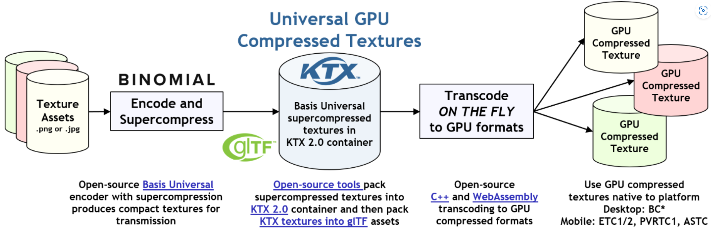
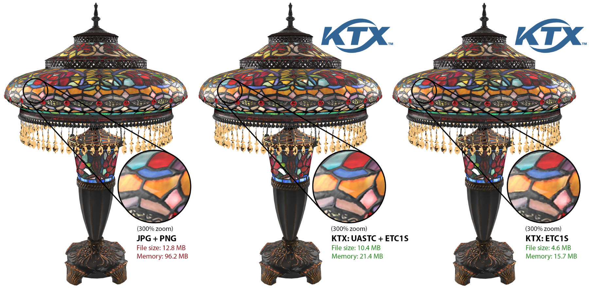
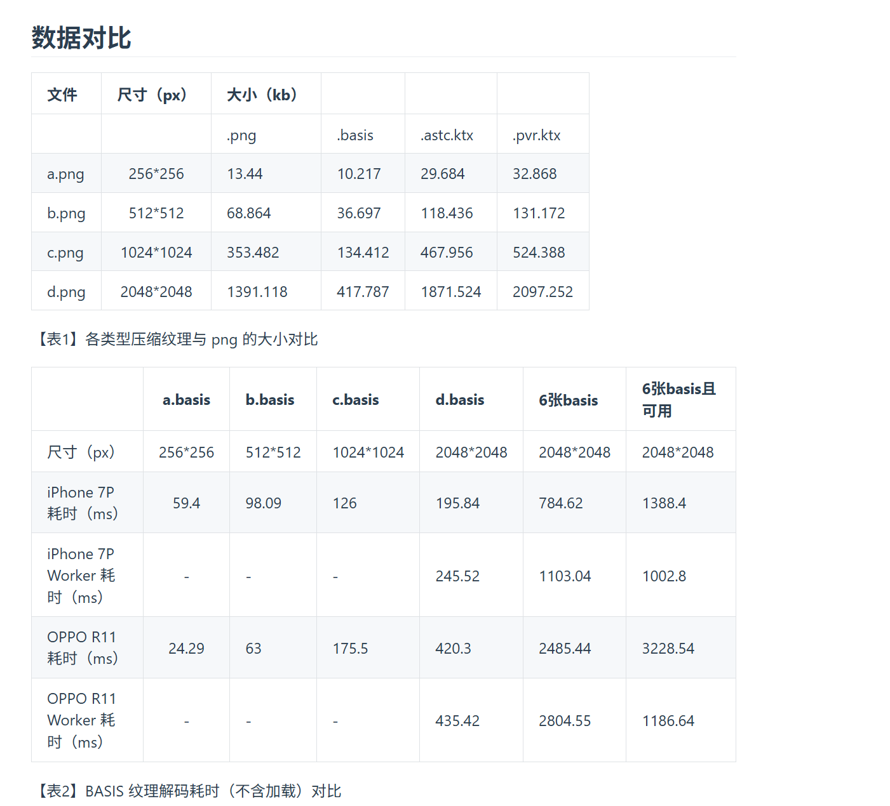
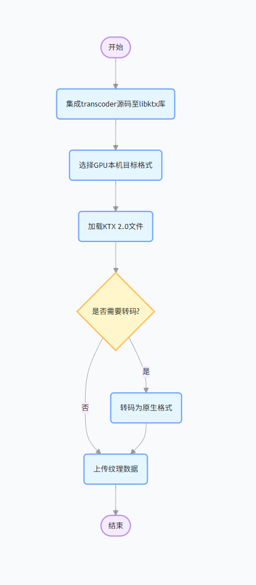
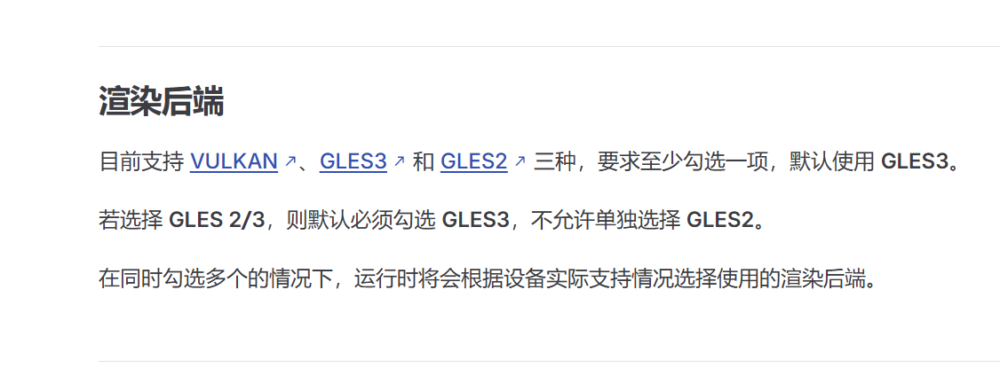
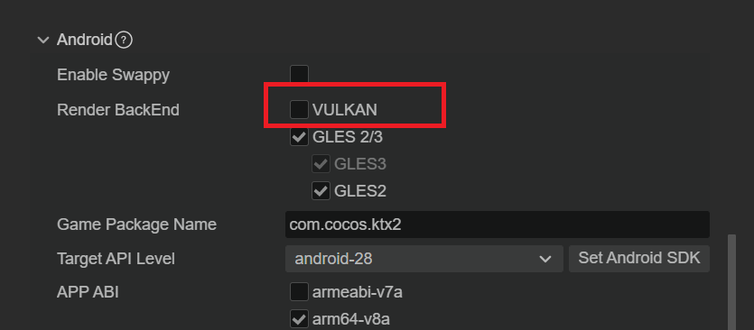
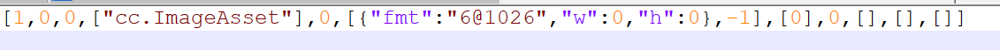
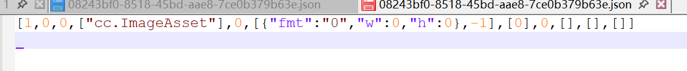
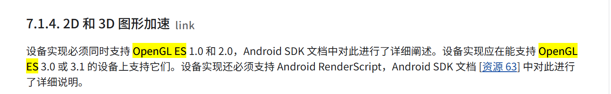

# 关于Basis Universal超级纹理压缩在cocos中应用的调研

## 一、前言

### **图片文件格式、纹理格式和纹理压缩：**

**图片文件格式**：将 **「位图信息（图像的表述方式，二维数组)」** 通过**特殊的编码**生成的存储格式，用于图像信息的存储和传输，一般在磁盘，内存及网络中存储与传输。我们经常看到的图片文件格式 有 png，jpg等格式， **「png（无损压缩）」** , **「jpg（有损压缩」** 也会把这些图片称为纹理，但他们并不是纹理格式，不能被GPU直接读取并显示。这些文件格式当被游戏读入后，需要经过CPU解码成 **「原始位图（位图的每个像素可以用RGB格式（像素/纹理格式）表述如：RGB565，RGBA4444，RGBA5555，RGB888, RGBA8888)」** ，再传送到GPU端进行使用。

**纹理格式** ：是能被GPU所识别的像素/纹理格式（ **「RGB565，RGBA4444，RGBA5555，RGB888, RGBA8888等」** ），能被快速寻址并采样。是GPU能直接使用的数据格式。

**纹理压缩** 是将纹理数据以压缩的形式存储到显存中，并使 GPU 可以直接加载和渲染这些数据。压缩后的纹理在保持可接受画质的前提下，将数据量压缩 50%-90%，同时支持硬件直接解码，避免 CPU 参与解压带来的开销。

常见的纹理压缩格式有：**ASTC、ETC1、ETC2和PVRTC等**

| 格式      | 块维度       | 比特/像素 (bpp)     | Alpha 支持       | 典型平台                       | 备注                                                         |
| :-------- | :----------- | :------------------ | :--------------- | :----------------------------- | :----------------------------------------------------------- |
| **ETC1**  | 4×4          | 8                   | 不支持           | Android/OpenGL ES 2.0          | Ericsson 早期标准，RGB 专用[Aras' website](https://aras-p.info/blog/2020/12/08/Texture-Compression-in-2020/?utm_source=chatgpt.com) |
| **ETC2**  | 4×4          | 4 (A1) 或 8 (A8)    | 1 位或全精度     | Android/OpenGL ES 3.0 及以上   | 向后兼容 ETC1，支持多种模式[Aras' website](https://aras-p.info/blog/2020/12/08/Texture-Compression-in-2020/?utm_source=chatgpt.com) |
| **PVRTC** | 4×4 (或可变) | 2 或 4              | 可选（模式决定） | iOS/PowerVR GPU                | Imagination 提供，移动端优势[NVIDIA Developer](https://developer.nvidia.com/astc-texture-compression-for-game-assets?utm_source=chatgpt.com) |
| **ASTC**  | 4×4–12×12    | 0.89–8（可调）      | 可选             | 跨平台（OpenGL ES 3.0/Vulkan） | Khronos 标准，可伸缩比特率与质量[Aras' website](https://aras-p.info/blog/2020/12/08/Texture-Compression-in-2020/?utm_source=chatgpt.com) |
| **ATC**   | 4×4          | 4 (RGB) 或 8 (RGBA) | 全精度           | AMD GPU                        | AMD 专有，桌面显卡支持[Themaister](https://themaister.net/blog/2020/08/12/compressed-gpu-texture-formats-a-review-and-compute-shader-decoders-part-1/?utm_source=chatgpt.com) |


根据[10、Cocos弹幕引擎低端设备上运行可行性调研——4.3纹理压缩研](https://wiki.imgo.tv/pages/viewpage.action?pageId=103806394)，通过压缩纹理可以将特效弹幕的CPU运行峰值从70%将至35%左右，但是采用压缩纹理会使得整个弹幕资源包大小膨胀。

烟花弹幕为例，使用**ASTC 8X8格式压缩纹理，包体会从7M膨胀至12M（在可接受范围内），ASTC仅支持OpenGL ES 3.0及以上 ，目前MAX盒子是支持的，但是在M1盒子采用的是OpenGL ES 2.0 ，其不支持 ASTC压缩。**

**针对OpenGL ES 2.0 的设备，只能采用ETC1的格式，经测试，****使用ETC1+A的格式压缩纹理，包体膨胀至73M；使用自动图集（Auto—Atlas）+ ETC1+A方法，包体会膨胀至28M。**

经查阅资料，cocos 官方论坛有人推荐针对低端设备[在Cocos Creator中使用 Basis Universal 纹理压缩 （超级压缩）](https://forum.cocos.org/t/topic/160336)可以优化性能的同时并且减小包体。


## 二、关于Basis Universal

**项目地址：[GitHub - BinomialLLC/basis_universal: Basis Universal GPU Texture Codec](https://github.com/BinomialLLC/basis_universal)**

Basis Universal 是一个超级压缩 GPU 纹理数据交换系统，主要功能如下：

- **支持多种文件格式**：支持两种中间文件格式，即 Khronos Group 的 [.KTX2 开放标准](https://registry.khronos.org/KTX/specs/2.0/ktxspec.v2.html)（KTX2可以理解为 .basis 压缩纹理格式的容器） 和自定义的 `.basis` 文件格式。这些格式能够快速转码为过去约 25 年中发布的几乎所有压缩 [GPU 纹理格式](https://en.wikipedia.org/wiki/Texture_compression)。
- **多种转码模式**：支持五种模式，分别是 ETC1S、UASTC LDR 4x4、UASTC HDR 4x4、UASTC HDR 6x6（有或无 RDO）以及 UASTC HDR 6x6 中间格式（“GPU Photo”）。
- **跨平台支持**：C/C++ 编码器（encoder）和解码器( transcoder )库可以编译为原生代码或 [WebAssembly | Wasm](https://developer.mozilla.org/en-US/docs/WebAssembly)，并且所有编码器 / 解码器功能都可以通过 C++ 包装库从 JavaScript 访问，该包装库还可选支持 [WASM 多线程](https://web.dev/articles/webassembly-threads)，以便在浏览器中进行快速编码。





Basis Universal 提供两种压缩选项。**ETC1S** 模式的传输和 GPU 内存大小明显小于 JPEG 和 PNG 纹理。**UASTC** 模式提供比 ETC1S 更高质量的纹理，同时仍能显著节省内存。

传统的 PNG、JPG 格式虽然做到了极致的压缩，但是送到 GPU 渲染时需要完全解码以支持 GPU 的随机访问。ETC、PVRTC 等纹理压缩格式虽然满足在运行时大大减少内存，但是在传输时比 PNG、JPG 占用更大的空间。总体看来，KTX2.0（BASIS）在权衡之后获得了更好的表现。




## 二、Basis Universal的应用

### 2.1  [Tiny.js （ 使用 BASIS 纹理）](http://tinyjs.net/guide/advanced-texture-basistexture.html)

Tiny.js 是一个基于 JavaScript 的轻量级游戏与图形渲染框架，主要面向 Web 平台。它集成 Basis Universal 的方案主要依靠 WebAssembly（WASM）实现动态加载和运行 Basis 转码器，同时通过插件机制将转码能力与纹理加载流程紧密结合，从而让开发者通过 WebAssembly 在运行时自动将压缩的 .basis 文件转换为适配当前 WebGL 环境的 GPU 压缩格式。

以下是 [Tiny.js](http://tinyjs.net/)引擎对BASIS纹理介绍的时候做到数据对比：



*注：以上数据仅供参考，不代表真实场景。*

> Tips
>
> - 从【表1】可以看出：.basis 格式甚至比 .png 还要小，尺寸越大越明显
> - 从【表2】可以看出：
>   1. 从 d.basis 的耗时分析可以估算 Worker 本身创建+通信是有一定损耗的（平均一次在 50ms 左右）
>   2. “6张basis” 的纯解码耗时因设备而异，Worker 的优势是可以并行执行，不阻塞后面的逻辑，正如“6张basis+可用”栏目，平均 1s 就能达到可用

优点：

- 一套资源：.basis
- 文件体积更小，常规的比 png 还小
- 有损性较低：最终的显示效果与原图基本相差不大

缺点：

- 需要额外加载两个解码相关的文件：basis_transcoder.js 和 basis_transcoder.wasm
- 有运行时开销：实时解码（借助 WebWorker 可缓解）


目前网上使用cocos进行Basis Universal 纹理压缩的均使用的是该方法，例如：

[GitHub - Jiawe1/cocos_basis_universal_loader: cocos creator load .basis demo](https://github.com/Jiawe1/cocos_basis_universal_loader) 该仓库的集成主要展示如何在 Cocos Creator 项目中实现 `.basis` 文件的压缩、加载和解析，以在 Cocos Creator 项目中使用 Basis Universal 纹理压缩，解决传统多种压缩格式配置下构建时间长和资源包体大的问题。

- 实现步骤如下：

  **1. 构建项目**：完成 Cocos Creator 项目的常规构建工作。
  **2. 压缩 .basis 文件**：使用 Basis Universal 提供的工具 basisu 对构建后的图片资源进行压缩。
  **3. 加载 .basis 文件**：新建 BasisDownloader.js 脚本并作为插件加载，在脚本中实现 .basis 文件的加载逻辑。
  **4. 解析 .basis 文件**：

  a)下载 basis 转码器，将 basis_transcoder.js 和 basis_transcoder.wasm 放到同一文件夹下，并确保 wasm 模块在 BasisDownloader.js 脚本之前实例化完成，否则可能导致 .basis 加载成功了却无法解析。

  b)实现parseBasis 函数，同时为了让 gl 调用 compressedTexImage2D 方法，需要重写相关方法。

  注意：在解析 .basis 文件之前，需要先判断当前设备支持的压缩格式，要在 `cc.game.EVENT_GAME_INITED` 之后再调用，否则可能会出现 canvas 颜色不对的问题。


[GitHub - x1phyr/cocos-ktx2-demo](https://github.com/x1phyr/cocos-ktx2-demo)   该仓库侧重于通过 KTX2 文件格式来容纳 Basis Universal 压缩数据，从而实现对超压缩纹理的统一管理。KTX2 是一种开放的容器格式，它不仅能存储基础的纹理信息（如多级 mipmaps、纹理方向等），还内嵌了 Basis Universal 编码的数据。该 demo 使用 Cocos Creator 3.x 版本，通过扩展资源加载器来支持 KTX2 纹理，并利用内置的 Basis Universal 转码器进行实时解码。

加载 KTX2 文件的整体流程

- **初始化模块**：加载 `basis_encoder.wasm` 文件并初始化 Basis Universal 转码器。
- **加载 KTX2 数据**：从指定的 UUID 加载 KTX2 文件的二进制数据。
- **解析 KTX2 文件**：使用初始化的模块解析 KTX2 文件，获取纹理的相关信息，如宽度、高度、层数、面数、是否有透明度等。
- **选择支持的压缩格式**：根据设备支持的压缩格式，选择合适的目标格式进行转码。
- **转码纹理数据**：将 KTX2 文件中的纹理数据转码为选择的目标格式。
- **创建并设置纹理**：使用转码后的数据创建 `Texture2D` 对象，并设置到 `SpriteFrame` 上显示。

- 

  

该方法体现了基于 JavaScript + WebAssembly 的集成模式，通常更契合 Web 平台和基于 Web 技术的跨平台引擎（比如 Cocos Creator）中的纹理加载与转码需求。


### 2.2 [ Vulkan （使用 Basis Universal 超级压缩 GPU 纹理编解码器 ）](https://docs.vulkan.net.cn/samples/latest/samples/performance/te xture_compression_basisu/README.html)

**Vulkan** 是由 Khronos Group 推出的低级别、多平台图形与计算 API。面向原生平台，提供对 GPU 的细粒度控制、优化多线程渲染流程，并以高效能和跨平台性著称，更适合高端、高性能原生游戏和图形计算应用。

Vulkan没有通过一个独立的库来使用 Basis Universal 转码，而是在项目中直接集成了其源代码。这些源码文件（例如 `basis_transcode.cpp`、`basisu_transcoder.h`、`basisu_transcoder.cpp` 等）都被包含在 libktx 的源码目录中，并通过 CMakeLists.txt 被纳入整体编译流程。 

流程图如下：



具体实现过程如下：

**1）将transcoder 的源码通过 CMakeLists.txt 集成至libktx 库，用来加载和转码 Basis Universal 压缩的 KTX 2.0 纹理**

```
# libktx
set(KTX_DIR ${CMAKE_CURRENT_SOURCE_DIR}/ktx)

set(KTX_SOURCES
    ...

    # Basis Universal
    ${KTX_DIR}/lib/basis_sgd.h
    ${KTX_DIR}/lib/basis_transcode.cpp
    ${KTX_DIR}/lib/basisu/transcoder/basisu_containers.h
    ${KTX_DIR}/lib/basisu/transcoder/basisu_containers_impl.h
    ${KTX_DIR}/lib/basisu/transcoder/basisu_file_headers.h
    ${KTX_DIR}/lib/basisu/transcoder/basisu_global_selector_cb.h
    ${KTX_DIR}/lib/basisu/transcoder/basisu_global_selector_palette.h
    ${KTX_DIR}/lib/basisu/transcoder/basisu_transcoder_internal.h
    ${KTX_DIR}/lib/basisu/transcoder/basisu_transcoder_uastc.h
    ${KTX_DIR}/lib/basisu/transcoder/basisu_transcoder.cpp
    ${KTX_DIR}/lib/basisu/transcoder/basisu_transcoder.h
    ${KTX_DIR}/lib/basisu/transcoder/basisu.h
    ${KTX_DIR}/lib/basisu/zstd/zstd.c

    ...
    # KTX2
    ${KTX_DIR}/lib/texture2.c
    ${KTX_DIR}/lib/texture2.h
```

**2）选择 GPU 本机目标格式**

ETC1S 与 UASTC 都是 **Basis Universal** 提供的「超压缩中间格式」，**无法**被 GPU 原生消费，需要在运行时或离线转码为真正的 GPU 支持格式（如 ETC1、ASTC、BCn、PVRTC 等）后，才能通过 `glCompressedTexImage2D` 上传渲染。

 KTX 2.0 文件以 Basis Universal ETC1S 和 UASTC 传输格式存储纹理数据，GPU 无法直接使用这些格式。因此，在将数据转码为本机 GPU 格式之前，需要选择一个有效的本机 GPU 目标格式。

```
void TextureCompressionBasisu::get_available_target_formats()
{
	available_target_formats.clear();

	VkPhysicalDeviceFeatures device_features = get_device().get_gpu().get_features();

	// Block compression
	if (device_features.textureCompressionBC)
	{
		// BC7 is the preferred block compression if available
		if (format_supported(VK_FORMAT_BC7_SRGB_BLOCK))
		{
            // Target formats from the KTX library, and prefixed with KTX_
			available_target_formats.push_back(KTX_TTF_BC7_RGBA);
		}

        ...
	}

	// Adaptive scalable texture compression
	if (device_features.textureCompressionASTC_LDR)
	{
        ...
    }

	// Ericsson texture compression
	if (device_features.textureCompressionETC2)
	{
        ...
    }

	// PowerVR texture compression support needs to be checked via an extension
	if (get_device().is_extension_supported(VK_IMG_FORMAT_PVRTC_EXTENSION_NAME))
	{
        ...
    }

	// Always add uncompressed RGBA as a valid target
	available_target_formats.push_back(KTX_TTF_RGBA32);
	available_target_formats_names.push_back("KTX_TTF_RGBA32");
}
```

**3）加载 KTX 2.0 文件**

加载和转码 KTX 2.0 纹理图像文件由 *libktx* 处理，并在 `TextureCompressionBasisu::transcode_texture` 函数内部完成。

使用 `ktxTexture2` 类，在某些函数调用中需要将其转换为 `ktxTexture`

```
// We are working with KTX 2.0 files, so we need to use the ktxTexture2 class
ktxTexture2 *ktx_texture;
// Load the KTX 2.0 file into memory. This is agnostic to the KTX version, so we cast the ktxTexture2 down to ktxTexture
KTX_error_code result = ktxTexture_CreateFromNamedFile(file_name.c_str(), KTX_TEXTURE_CREATE_LOAD_IMAGE_DATA_BIT, (ktxTexture **) &ktx_texture);
if (result != KTX_SUCCESS)
{
    throw std::runtime_error("Could not load the requested image file.");
}
```

**4）转码为原生格式**

将磁盘加载的文件从 ETCS1/UASTC 转码为我们之前创建的列表中所需的目标格式。

通过 `ktxTexture2_NeedsTranscoding` 检查源 KTX 2.0 文件是否真的需要转码。如果文件例如已经包含像 BCn 这样的原生格式，那么不必对其进行转码。

如果文件需要转码，我们然后通过 *libktx* 调用 Basis Universal 转码器，使用 `ktxTexture2_TranscodeBasis`。这会将纹理数据转码为 GPU 原生目标格式。

```
if (ktxTexture2_NeedsTranscoding(ktx_texture))
{
    result = ktxTexture2_TranscodeBasis(ktx_texture, target_format, 0);
    if (result != KTX_SUCCESS)
    {
        throw std::runtime_error("Could not transcode the input texture to the selected target format.");
    }
}
```

**5）上传纹理数据**

一旦转码完成，`ktxTexture` 对象包含原生 GPU 格式的纹理数据（例如上面示例中的 BC7），然后可以直接上传到支持 BC7 纹理压缩的 GPU。从这一点开始，它就像使用常规纹理一样。我们然后可以使用 `ktxTexture` 对象中的原生 Vulkan 格式来创建 Vulkan 图像。

```
VkFormat format = (VkFormat)ktx_texture->vkFormat;

// Create a buffer to store the transcoded ktx texture data for staging to the GPU
VkBufferCreateInfo buffer_create_info = vkb::initializers::buffer_create_info();
buffer_create_info.size               = ktx_texture->dataSize;

...

// Copy the ktx texture into the host local buffer
uint8_t *data;
vkMapMemory(get_device().get_handle(), staging_memory, 0, memory_requirements.size, 0, (void **) &data);
memcpy(data, ktx_image_data, ktx_texture->dataSize);
vkUnmapMemory(get_device().get_handle(), staging_memory);

// Setup buffer copy regions for each mip level
std::vector<VkBufferImageCopy> buffer_copy_regions;
for (uint32_t mip_level = 0; mip_level < texture.mip_levels; mip_level++)
{
    ktx_size_t        offset;
    KTX_error_code    result                           = ktxTexture_GetImageOffset((ktxTexture *) ktx_texture, mip_level, 0, 0, &offset);
    VkBufferImageCopy buffer_copy_region               = {};
    buffer_copy_region.imageSubresource.aspectMask     = VK_IMAGE_ASPECT_COLOR_BIT;
    buffer_copy_region.imageSubresource.mipLevel       = mip_level;
    buffer_copy_region.imageSubresource.baseArrayLayer = 0;
    buffer_copy_region.imageSubresource.layerCount     = 1;
    buffer_copy_region.imageExtent.width               = ktx_texture->baseWidth >> mip_level;
    buffer_copy_region.imageExtent.height              = ktx_texture->baseHeight >> mip_level;
    buffer_copy_region.imageExtent.depth               = 1;
    buffer_copy_region.bufferOffset                    = offset;
    buffer_copy_regions.push_back(buffer_copy_region);
}

...

VkImageCreateInfo image_create_info = vkb::initializers::image_create_info();
image_create_info.imageType         = VK_IMAGE_TYPE_2D;
image_create_info.format            = format;
image_create_info.mipLevels         = texture.mip_levels;
image_create_info.arrayLayers       = 1;
image_create_info.samples           = VK_SAMPLE_COUNT_1_BIT;
image_create_info.tiling            = VK_IMAGE_TILING_OPTIMAL;
image_create_info.sharingMode       = VK_SHARING_MODE_EXCLUSIVE;
image_create_info.initialLayout     = VK_IMAGE_LAYOUT_UNDEFINED;
image_create_info.extent            = {texture.width, texture.height, 1};
image_create_info.usage             = VK_IMAGE_USAGE_TRANSFER_DST_BIT | VK_IMAGE_USAGE_SAMPLED_BIT;
vkCreateImage(get_device().get_handle(), &image_create_info, nullptr, &texture.image);

...

// Upload data to the Vulkan image using a command buffer

VkCommandBuffer copy_command = device->create_command_buffer(VK_COMMAND_BUFFER_LEVEL_PRIMARY, true);
...
vkCmdCopyBufferToImage(
    copy_command,
    staging_buffer,
    texture.image,
    VK_IMAGE_LAYOUT_TRANSFER_DST_OPTIMAL,
    static_cast<uint32_t>(buffer_copy_regions.size()),
    buffer_copy_regions.data());
...
device->flush_command_buffer(copy_command, queue, true);
```

关键细节包括：

- **数据封装：** 使用 KTX2 格式将 Basis 压缩数据、mipmap 等信息封装在一起。
- **源码集成：** 直接将 Basis Universal 转码器源码整合进项目，通过 CMake 管理，方便调试和定制。
- **动态适配：** 在运行时根据设备能力检测选择 GPU 支持的目标格式，并实时完成从 ETC1S/UASTC 到 GPU 原生格式的转码。
- **高效上传：** 转码后的数据通过 Vulkan API 快速上传到 GPU，确保高性能渲染。

这种做法使得项目可以在编译时将 Basis Universal 转码器作为一部分进行构建，无需额外依赖独立库，从而更便于调试和定制转码流程。


## 四、**关于basisu解码器（transcoder）**

整个transcoder位于单个 .cpp 文件中：transcoder/basisu_transcoder.cpp，并且除了 C/C ++ runtime和可能的 zstddeclib.c 之外没有其他依赖项（如果在编译时启用了 KTX2 Zstandard）。如果使用 gcc/clang 进行编译，请确保在编译此文件时禁用严格别名 （-fno-strict-aliasing）。

```
#include "transcoder/basisu_transcoder.h"

basist::basisu_transcoder_init()  
##此外，理想情况下，在启动时，您需要创建 basist::etc1_global_selector_codebook 类的单个实例。
basist::etc1_global_selector_codebook sel_codebook(basist::g_global_selector_cb_size, basist::g_global_selector_cb);

#现在，您可以使用 basisu_transcoder 和 ktx2_transcoder 类中实现的 transcoder。 
start_transcoding()
get_total_images()
get_image_info()
get_image_level_info()
transcode_image_level()

注意：官方将简化transcoder(解码器)，以便调用方无需很快处理etc1_global_selector_codebook。ETC1S 标准实际上并不支持Global selector codebooks。#include "transcoder/basisu_transcoder.h" basist::basisu_transcoder_init()   ##此外，理想情况下，在启动时，您需要创建 basist::etc1_global_selector_codebook 类的单个实例。 basist::etc1_global_selector_codebook sel_codebook(basist::g_global_selector_cb_size, basist::g_global_selector_cb); #现在，您可以使用 basisu_transcoder 和 ktx2_transcoder 类中实现的 transcoder。  start_transcoding() get_total_images() get_image_info() get_image_level_info() transcode_image_level() 注意：官方将简化transcoder(解码器)，以便调用方无需很快处理etc1_global_selector_codebook。ETC1S 标准实际上并不支持Global selector codebooks。 
```


## **五、Basis Universal的集成方案**

**方案一：**

参考webgl端的方法，将**transcoder**集成至引擎库，选择 Native 而不是 WASM模块进行格式转换，以下是AI给出的具体实现方法：

Cocos Creator 支持在原生构建中从 TypeScript 调用 C++ 的两种主要方式：

1. **JSB 手动或自动绑定**（推荐用于引擎级 API）[使用 JSB 手动绑定 ](https://docs.cocos.com/creator/3.8/manual/zh/advanced-topics/jsb-manual-binding.html) 和 [使用 JSB 自动绑定 ](https://docs.cocos.com/creator/3.8/manual/zh/advanced-topics/jsb-auto-binding.html)
2. 通过 CMake 的**本机插件**`cc_plugin.json`（适用于第三方库）[原生插件创建范例 ](https://docs.cocos.com/creator/3.8/manual/zh/advanced-topics/native-plugins/tutorial.html)

参考webgl端的调用和加载文件逻辑，将**transcoder**集成至引擎库，选择 Native 而不是 WASM进行格式转换

**a) 将基础转码器添加到引擎构建中**

1. 复制源
   - `basisu_transcoder.cpp`& `basisu_transcoder.h`→`<engine-root>/external/basis_universal/transcoder/`
   - `zstddeclib.c`→`<...>/zstd/`
2. **更新 CMakeLists/[Android.mk](http://Android.mk)**
   - 在您的 Android CMake 目标中包含新的源目录。
   - `transcoder/`添加和的包含路径`zstd/`。
   - 定义编译标志：`-DBASISD_SUPPORT_KTX2=1`，，`-DBASISD_SUPPORT_KTX2_ZSTD=1`禁用严格别名：`-fno-strict-aliasing`。

**b) 编写一个小型 C++ Wrapper**

在（或适当的模块）`CCKtx2Transcoder.cpp/h`下创建：`<engine-root>/cocos/renderer/gfx/>`

```
#include "basisu_transcoder.h"
#include "ktx2_transcoder.h"
using namespace basist;

namespace cc {
class Ktx2Transcoder {
public:
    static bool init() {
        basisu_transcoder_init();
        static etc1_global_selector_codebook g_sel_codebook(g_global_selector_cb_size, g_global_selector_cb);
        return true;
    }
    static cc::Texture2D* transcode(const std::vector<uint8_t>& data) {
        ktx2_transcoder transcoder(data.data(), data.size());
        if (!transcoder.start_transcoding()) return nullptr;
        auto info = transcoder.get_image_info(0,0);
        std::vector<uint8_t> dst(info.m_total_blocks * info.m_bytes_per_block);
        transcoder.transcode_image_level(dst.data(), 0,0, info.m_format, info.m_layer, info.m_face);
        // Create and return a new Cocos Texture2D from dst, info.m_width, info.m_height
        return cc::gfx::Device::getInstance()->createTexture(dst, info.m_width, info.m_height, /*format*/);
    }
};
}
```

这反映了 TS 中的 WASM API。

**c）注册到JSB（手动绑定）**

在您的 JSB 绑定文件中（`bindings/jsb_cc_ktx2.cpp`）：

```
#include "cocos/bindings/jswrapper/SeApi.h"
#include "CCKtx2Transcoder.h"

SE_BIND_FUNC(cc::Ktx2Transcoder::init)
SE_BIND_FUNC(jsb_cc_Ktx2Transcoder_transcode)

bool register_ktx2_module(se::Object* obj) {
    se::Namespace ns(obj);
    ns.getNamespace("cc")
      .defineFunction("initBasis", _SE(cc::Ktx2Transcoder::init))
      .defineFunction("transcodeKTX2", _SE(jsb_cc_Ktx2Transcoder_transcode));
    return true;
}

```

并添加`register_ktx2_module`到引擎的模块注册列表中（例如`jsb_module_register.cpp`）。[JSB 2.0 绑定教程 | Cocos Creator](https://docs.cocos.com/creator/3.8/manual/zh/advanced-topics/JSB2.0-learning.html#jsb-2-0-绑定教程)

**d）修改 TS Loader 使用 Native 调用**

在 中**`KTX2Loader.ts`**，用直接 JSB 调用替换 WASM 初始化/转码序列：

```
declare function initBasis(): boolean;
declare function transcodeKTX2(data: Uint8Array): { data: Uint8Array, width: number, height: number, format: number };

public async initBasicModule() {
  if (!initBasis()) {
    console.warn("Failed to init native Basis transcoder");
  }
}

public async loadKTX2(data: ArrayBuffer): Promise<Texture2D> {
  const { data: dst, width, height, format } = transcodeKTX2(new Uint8Array(data));
  const tex = new Texture2D();
  tex.reset({ width, height, format });
  tex.uploadData(dst);
  return tex;
}
```

不再需要 WASM 或`basis_encoder.js`；繁重的工作由本机完成。

 

**方案二：**

cocos creator是可以支持Vulkan 渲染后端的，但是并没有集成Basis Universal 解码器，可以参考[Vulkan 使用 Basis Universal 超级压缩 GPU 纹理编解码器](https://docs.vulkan.net.cn/samples/latest/samples/performance/te xture_compression_basisu/README.html)示例通过Vulkan实现解码。但是从 Android 7.0（API 级别 24）开始便可在 Android 上使用，且并非所有搭载 Android 7.0 或更高版本的 Android 设备都支持 Vulkan。





**方案三：**

参照Vulkan引擎的逻辑，将Basis Universal 解码器( transcoder )的源码集成至目前的cocos 弹幕渲染引擎[Mgtv-CocosDanmu-Lib](http://gerrit.nunaios.com/#/q/project:mgtv/tvos/Mgtv-CocosDanmu-Lib)，然后再实现具体逻辑。

初步想法是参考Cocos 引擎读取ETC1压缩文件(.PKM文件)的流程，初步判断，使用压缩纹理之后，cocos creator会把原本的PNG格式替换成相应的压缩纹理格式，然后再jason的相应参数。





新增加载和解析.KTX2文件，再按照相应格式转换


## 六、openGL ES 对硬件和系统的要求

Android 开发文档指出，**OpenGL ES 2.0** 规范从 Android 2.2（API级别8）开始支持，**OpenGL ES 3.0** 从 Android 4.3（API级别18）开始支持[developer.android.com](https://developer.android.com/develop/ui/views/graphics/opengl/about-opengl?hl=zh-cn#:~:text=* OpenGL ES 2.0 ,0（API 级别 24）及更高版本的支持。)

Android 5.1（API 22）本身对 ES3.0/3.1 已经开放支持，设备只要硬件允许就可实现。Android 兼容性定义（CDD）规定，所有设备必须支持 OpenGL ES 1.0 和 2.0；对于能够运行 ES3.0/3.1 的设备，应当实现相应支持[source.android.com](https://source.android.com/docs/compatibility/5.1/android-5.1-cdd?hl=zh-cn#7_1_4_2d_and_3d_graphics_acceleration)



Android 兼容性仪表盘显示，活跃 Android 设备中 ES 2.0 占 4.1%，ES 3.x（3.0/3.1/3.2）合计占 96.9%[Android Developers](https://developer.android.com/about/dashboards?utm_source=chatgpt.com)。

| 版本               | 系统最低要求                                                 | 硬件最低要求                                                 |
| ------------------ | ------------------------------------------------------------ | ------------------------------------------------------------ |
| **OpenGL ES 2.0**  | Android 2.2 (API Level 8) 或更高 [Android Developers](https://developer.android.com/ndk/guides/stable_apis?utm_source=chatgpt.com) | GPU 支持 ES 1.1/2.0，如 Mali-450、Adreno 200 系列 [Arm开发者](https://developer.arm.com/ip-products/graphics-and-multimedia/mali-gpus/mali-450-gpu?utm_source=chatgpt.com)[GitHub](https://github.com/ARM-software/armnn/issues/446?utm_source=chatgpt.com) |
| **OpenGL ES 3.0+** | Android 4.3 (API Level 18) 或更高 [Android Developers](https://developer.android.com/develop/ui/views/graphics/opengl/about-opengl?utm_source=chatgpt.com)[Android Developers](https://developer.android.com/ndk/guides/stable_apis?utm_source=chatgpt.com) | GPU 支持 ES 3.0/3.1/3.2，如 Mali-T720、T820、G31、G52、Adreno 320+ [Arm开发者](https://developer.arm.com/ip-products/graphics-and-multimedia/mali-gpus/mali-t720-gpu?utm_source=chatgpt.com)[Collabora /\| Open Source Consulting](https://www.collabora.com/news-and-blog/blog/2021/06/11/open-source-opengl-es-3.1-on-mali-gpus-with-panfrost/?utm_source=chatgpt.com) |

OpenGL ES 规范只定义 GPU 接口与行为，不对宿主系统（如机顶盒）的内存大小提出硬性要求；RAM 更多影响运行时性能、纹理/缓冲区规模，但非标准必需项。


压缩命令指南可参考：

[basisu.exe Command Line Tool Options · BinomialLLC/basis_universal Wiki · GitHub](https://github.com/BinomialLLC/basis_universal/wiki/basisu.exe-Command-Line-Tool-Options)

[How to Use and Configure the Transcoder · BinomialLLC/basis_universal Wiki · GitHub](https://github.com/BinomialLLC/basis_universal/wiki/How-to-Use-and-Configure-the-Transcoder)


参考文献：

[Tiny.js | 使用 BASIS 纹理](http://tinyjs.net/guide/advanced-texture-basistexture.html)

[GitHub - Jiawe1/cocos_basis_universal_loader: cocos creator load .basis demo](https://github.com/Jiawe1/cocos_basis_universal_loader)

[GitHub - x1phyr/cocos-ktx2-demo](https://github.com/x1phyr/cocos-ktx2-demo)

[WebAssembly | MDN](https://developer.mozilla.org/en-US/docs/WebAssembly)

[在Cocos Creator中使用 Basis Universal 纹理压缩 （超级压缩） - Creator 2.x - Cocos中文社区](https://forum.cocos.org/t/topic/160336)

[在 Vulkan 中使用 Basis Universal 超级压缩 GPU 纹理编解码器 :: Vulkan 文档项目](https://docs.vulkan.net.cn/samples/latest/samples/performance/texture_compression_basisu/README.html)

[KTX 概览- The Khronos Group Inc 公司](https://www.khronos.org/ktx/)