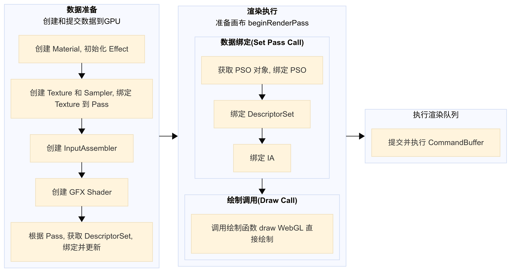

# Cocos Creator渲染性能调优(2D/3D Drawcall优化)

## 一、前言

图形渲染管线的大致流程如下：

CPU提交数据给GPU，向GPU下渲染命令的过程通常被称为DrawCall，即同一批次的渲染，一次DrawCall就代表一次图形的绘制命令。

在cocos 引擎中渲染层被抽象和封装成“GFX”，通过GFX抽象层提交渲染命令到GPU，这可以屏蔽底层的图形接口（OpenGL、Vulkan、Metal ……），仅暴露给上层一个统一的图形接口，以达到编写一次渲染代码，适配不同渲染后端的目的。

GFX渲染过程可以简单分为2个阶段，**数据准备**和**渲染执行** ，**渲染执行**又可分为**数据绑定**和**绘制调用**。实际游戏中**渲染执行**中会反复执行多个 DrawCall，直到完成一帧中的所有绘制。

GFX渲染流程如下：

- **数据准备**：创建和提交数据到GPU
  - 创建Material，初始化Effect
  - 创建Texture和Sampler，并绑定Texture到Pass
  - 创建InputAssembler
  - 创建GFX Shader
  - 根据Pass，从对象池获取DescriptorSet， 绑定并更新
- **渲染执行**：准备画布beginRenderPass
  - **数据绑定**：（Set Pass Call）
    - 获取PSO对象，绑定PSO
    - 绑定DescriptorSet
    - 绑定IA
  - **绘制调用：(Draw Call)**
    - 调用绘制函数draw(WebGL直接绘制)
- **执行渲染队列**
  - 提交并执行CommandBuffer

## 二、关于DrawCall 与合批

CPU和GPU通过**命令缓冲区（Command Buffer）**实现并行工作，Command Buffer包含一个命令队列，当CPU需要渲染对象时，可以向命令队列添加命令，而GPU完成上次渲染任务之后，可以继续从命令队列里取出一个命令执行。

从渲染管线和GFX渲染流程中可以看出，**每一次DrawCall前，CPU需准备绘制参数（如纹理状态、Blend模式等），若DrawCall数量过多，会加重CPU负担，导致性能下降。同时，GPU频繁切换渲染状态（如纹理、深度测试）也会增加消耗。**

**性能瓶颈**：CPU端表现为提交DrawCall耗时过长，GPU端表现为渲染状态切换频繁，均可能导致帧率下降，游戏卡顿。

**优化思路**：**降低 DrawCall 是提升游戏渲染效率**一个非常直接有效的办法，通过**批次合并（合批或合图**）减少DrawCall次数，适合静态对象一次性合并，动态对象需考虑每帧合并成本。

#### 2.1 合批的核心条件

1. **相同 Layer**：节点需处于同一 Layer 才能合批，不同 Layer 间无法合并。
2. **相同渲染状态**：包括纹理状态（预乘、循环模式、过滤模式）、材质（Material）、混合模式（Blend）等必须一致。
3. **相邻节点层级**：渲染顺序相邻的节点更易合批，避免被其他组件（如 Label、Mask）打断。
4. 支持合批的组件：
   - 2D：Sprite、Label（需满足特定条件）。
   - 3D：MeshRenderer（非 SkinnedMeshRenderer）。

可参考[2D 渲染组件合批规则说明 | Cocos Creator](https://docs.cocos.com/creator/3.8/manual/zh/ui-system/components/engine/ui-batch.html#合批条件说明)

#### **2.2  常用合批技术**

合批常用的技术手段有**静态合批、 动态合批和 GPU Instancing合批**

| 合批方式           | 原理                                                         | 优点                                                         | 缺点                                                         |
| ------------------ | ------------------------------------------------------------ | ------------------------------------------------------------ | ------------------------------------------------------------ |
| **静态合批**       | 预先将“能够合批”的物体的网格合并成一个大网格，存入内存，并在渲染时作为一个整体提交给GPU。 | - 能提升渲染性能，减少Drawcall。  - 适用于静态物体的合批。 | - 需要预先计算合并网格，初始化时间增加。  - 合并后的网格无法移动，否则需要重新计算合批，导致CPU开销增加。  - 可能会增大内存开销，尤其是当原始网格重复率较高时。 |
| **动态合批**       | 每次渲染时，CPU计算所有“能够合批”物体的世界坐标，将转换后的顶点数据提交给GPU，同时使用单位矩阵代替原始变换矩阵。 | - 适用于移动的物体。  - 没有额外的内存开销。  - 依然能够减少Drawcall，提高渲染性能。 | - 每次渲染前，CPU需要重新计算顶点世界坐标，增加CPU负担。  - 不适用于顶点数过多的物体，否则CPU开销过高。 |
| **GPU Instancing** | 仅提交一次模型数据，使用GPU批量绘制多个实例，实例的位置信息、旋转、缩放等参数通过Uniform或缓冲区提交给GPU。 | - 高效的合批方式，减少Drawcall。  - 几乎没有额外开销，计算在GPU上进行，减少CPU负担。  - 适用于同一物体的多个实例，如大规模重复物体（如森林、草地）。 | - 仅支持相同的模型实例。 - 需要Shader支持，较复杂的Shader编写可能带来额外工作量。  - 部分早期显卡不支持GPU Instancing。 |

## 三、Cocos 中如何优化3D物体Drawcall

### 3.1 静态合批

目前静态合批方案为运行时静态合批，通过调用 `BatchingUtility.batchStaticModel` 可进行静态合批。
该函数接收一个节点，然后将该节点下的所有 `MeshRenderer` 里的 `Mesh` 合并成一个，并将其挂到另一个节点下。
在合批后，将无法改变原有的 `MeshRenderer` 的 `transform`，但可以改变合批后的根节点的 `transform`。

只有满足以下条件的节点才能进行静态合批：

- 子节点中只能包含 `MeshRenderer`；
- 子节点下的 `MeshRenderer` 的 `Mesh` 的顶点数据结构必须一致；
- 子节点下的 `MeshRenderer` 的材质必须相同。

### 3.2 动态合批

引擎目前提供 instancing 动态合批功能。
要开启合批，只需在模型所使用的材质中对应勾选 `USE_INSTANCING` 开关即可。

> **注意**：目前的合批流程会引入一些限制：
>
> 1. 同一批次的透明模型间的绘制顺序无法保证，可能导致混合效果不准确；
> 2. 合批后没有传递逆转置世界矩阵信息，带有非均一缩放的模型的法线会不准确；
> 3. 只支持普通 3D 模型和预烘焙骨骼动画控制下的蒙皮模型（实时计算骨骼动画、2D 物体、UI、粒子等均不支持动态合批）。

### 3.3 Instancing 合批

通过 Instancing 的合批适用于绘制大量顶点数据完全相同的动态模型，启用后绘制时会根据材质和顶点数据分组，每组内组织 instanced attributes 信息，然后一次性完成绘制。

关于蒙皮模型的支持及相关设定，参考 [骨骼动画组件](https://docs.cocos.com/creator/3.8/manual/zh/animation/skeletal-animation.html#关于动态-Instancing)。

另外 instancing 还支持自定义额外的 instanced attributes，可以传递更多不同 instance 之间的差异性数据（比如不同人物间给一个漫反射颜色的外观差异，或大片草地中的风力影响）。
这需要自定义 effect 的支持，更详细的说明可以参考 [语法指南](https://docs.cocos.com/creator/3.8/manual/zh/shader/effect-syntax.html#自定义几何体实例化属性)

关于3D物体的合批具体可参考[MeshRenderer 组件参考 | Cocos Creator](https://docs.cocos.com/creator/3.8/manual/zh/engine/renderable/model-component.html#instancing-合批)

## 四、Cocos 中如何优化2D物体Drawcall

### 4.1 [2D渲染组件](https://docs.cocos.com/creator/3.8/manual/zh/2d-object/2d-render/#_2d-渲染组件)

Cocos的2D 渲染组件包括：

- [Sprite 组件参考](https://docs.cocos.com/creator/3.8/manual/zh/ui-system/components/editor/sprite.html)
- [Label 组件参考](https://docs.cocos.com/creator/3.8/manual/zh/ui-system/components/editor/label.html)
- [Mask 组件参考](https://docs.cocos.com/creator/3.8/manual/zh/ui-system/components/editor/mask.html)
- [Graphics 组件参考](https://docs.cocos.com/creator/3.8/manual/zh/ui-system/components/editor/graphics.html)
- [RichText 组件参考](https://docs.cocos.com/creator/3.8/manual/zh/ui-system/components/editor/richtext.html)
- [UIStaticBatch 组件参考](https://docs.cocos.com/creator/3.8/manual/zh/ui-system/components/editor/ui-static.html)
- [TiledMap 组件参考](https://docs.cocos.com/creator/3.8/manual/zh/editor/components/tiledmap.html)
- [TiledTile 组件参考](https://docs.cocos.com/creator/3.8/manual/zh/editor/components/tiledtile.html)
- [Spine（骨骼动画）Skeleton 组件参考](https://docs.cocos.com/creator/3.8/manual/zh/editor/components/spine.html)
- [DragonBones（龙骨）ArmatureDisplay 组件参考](https://docs.cocos.com/creator/3.8/manual/zh/editor/components/dragonbones.html)
- [MotionStreak 组件参考](https://docs.cocos.com/creator/3.8/manual/zh/editor/components/motion-streak.html)

2D 渲染组件合批需要满足以下几点条件：

| 条件                                                         | 说明                                                         |
| :----------------------------------------------------------- | :----------------------------------------------------------- |
| 节点的 Layer 相同                                            | 由于 Layer 与节点是否渲染相关，因此不同的 Layer 之间不能进行合批。 |
| 使用的材质相同                                               | **材质相同是合批的必要要求**。 由于 Creator 使用的是 **材质实例化** 的机制，所以当用户在设置了材质的 `uniform` 之后，材质会进行实例化，实例化之后的材质是无法进行合批的。 如果用户在自定义材质中设置了 `uniform`（对应组件无法进行合批），在 `uniform` 值使用完毕后想要该组件参与合批，那么可通过 `CustomMaterial` 接口将材质资源重新赋值给组件即可。 |
| 渲染组件上所添加的材质的 `BlendState` 和 `DepthStencilState` 属性设置相同 | `DepthStencilState` 属性用于控制组件的深度检测和模板缓冲，是由引擎自动控制（用于 Mask 的效果实现）的，一般来说用户不需关心该属性的设置。 |
| 渲染组件的顶点信息要在同一个 **buffer** 中上传（v3.4.1 新增） | 一般情况下顶点信息是由引擎统一进行分配和管理的，用户无需关心。若想要了解更多相关信息，请参考下文 **MeshBuffer 合批说明** 部分的内容。 |
| 贴图源以及贴图采样相同                                       | 一般情况下该条件是影响合批最主要的因素，尤其对于 Sprite 和 Label 来说，贴图很容易产生差别导致无法合批。Creator 提供了部分方法用于更好地实现合批，详情请参考下文 **合批方法说明** 部分的内容。 |

2D 渲染组件的渲染数据采集使用的是基于 **节点树** 的渲染方式，而有部分组件无法合批，且会打断其他组件合批，需要用户进行分模块管理节点树布局，以达到更好的合批效果。无法合批的组件包括：

- 内置组件 Mask、Graphics 和 UIMeshRenderer 组件由于材质不同和数据组织方式的差异，无法与其他组件合批；
- TiledMap、Spine 和 DragonBones 这三个中间件组件则是遵循自己的内部合批机制。

对于 Sprite 和 Label 组件来说，因为贴图很容易产生差别，导致无法合批。因此Cocos提供了以下方法可以更好地实现合批，用户可以根据需要参考使用：

- **对于 Sprite 组件，cocos提供了 [静态合图](https://docs.cocos.com/creator/3.8/manual/zh/asset/auto-atlas.html) 和 [动态合图](https://docs.cocos.com/creator/3.8/manual/zh/advanced-topics/dynamic-atlas.html) 两种合批方案，**通过将图片纹理合并，即可在其他条件满足的情况下进行合批。
- **对于 Label 组件，cocos提供了 Bitmap 的缓存方法**，通过将 Label 的纹理合图，即可实现 Sprite 和 Label 组件的合批，但需要注意的是，使用 Bitmap 缓存方式的 Label 不可频繁变动文字内容。

一般来说，通过控制材质和节点树状态，然后配合合图方法，便能够达到较好的合批效果。

### 4.2 Sprite 组件的合批方案

#### 4.2.1 静态合图

静态合图就是在开发时**将一系列碎图整合成一张大图**，最重要的是**尽量将处于同一界面（UI）下的相邻且渲染状态相同的碎图打包成图集**，才能达到减少 DrawCall 的目的。

在游戏中使用多张图片合成的图集作为美术资源，有以下优势：

- 合成图集时会去除每张图片周围的空白区域，加上可以在整体上实施各种优化算法，合成图集后可以大大减少游戏包体和内存占用
- 多个 Sprite 如果渲染的是来自同一张图集的图片时，这些 Sprite 可以使用同一个渲染批次来处理，大大减少 CPU 的运算时间，提高运行效率。

实现静态合批的方法有两种：

1. 使用cocos中的**自动图集（Auto Atlas）**进行自动静态合图
2. 通过TexturePacker 手动打包图集之后再导入cocos creator使用

**自动图集** 作为 Cocos Creator 自带的合图功能，可以将指定的一系列碎图打包成一张大图，具体作用和 Texture Packer 的功能很相近。

具体使用方式可参考[自动图集资源 (Auto Atlas) | Cocos Creator](https://docs.cocos.com/creator/3.8/manual/zh/asset/auto-atlas.html#自动图集资源-auto-atlas)

在项目构建时，编辑器会将所有自动图集资源所在文件夹下的所有符合要求的图像分别根据配置打包成一个或多个图集。

自动图集资源使用起来很灵活，编辑器在打包图集时会自动递归子目录，若子目录下也有自动图集资源（即 `.pac` 文件）则会跳过该目录，所以我们可以对同一目录下的不同部分的碎图配置不同的参数。

#### 4.2.2  动态合图

 从Cocos Creator 在 v2.0 开始加入了 **「动态合图」**（**Dynamic Atlas**）的功能，它能在项目运行时动态的将贴图合并到一张大贴图中。当渲染一张贴图的时候，动态合图系统会自动检测这张贴图是否已经被合并到了图集中，如果没有，并且此贴图又符合动态合图的条件，就会将此贴图合并到图集中。

简单来说，开启动态合图之后，引擎会在运行时帮我们对符合条件（即尺寸小于碎图限制的最大尺寸）的精灵(Sprit)进行合图，达到和提前打包图集一样的效果。

具体使用方式可参考[动态合图 (Dynamic Atlas)| Cocos Creator](https://docs.cocos.com/creator/3.8/manual/zh/advanced-topics/dynamic-atlas.html#动态合图)

Cocos 官方手册提示：**启用动态合图会占用额外的内存，不同平台占用的内存大小不一样。目前在小游戏和原生平台上默认会禁用动态合图，但如果你的项目内存空间仍有富余的话建议开启。**

### 4.3 Label 组件的合批方案

在场景中使用系统字体或 TTF 字体的 Label 会打断渲染合批，特别是 Label 和 Sprite 层叠交错的情况，每一个 Label 都会打断合批增加一个 DrawCall。

方式一：对于游戏中常用的文本，特别是数字、字母和符号，都建议**「使用 BMFont 来代替 TTF 或系统字体」**，并且**「将 BMFont 与 UI 碎图打包到同一图集中」**（或**「开启动态合图」**），可以免除大部分文本导致的 DrawCall。

方式二：合理选择[文本缓存类型（Cache Mode）](https://docs.cocos.com/creator/3.8/manual/zh/ui-system/components/editor/label.html#文本缓存类型-cache-mode)

Cache Mode官方说明：

| 类型   | 功能说明                                                     |
| :----- | :----------------------------------------------------------- |
| NONE   | 默认值，Label 中的整段文本将生成一张位图。                   |
| BITMAP | 选择后，Label 中的整段文本仍将生成一张位图，但是会尽量参与 [动态合图](https://docs.cocos.com/creator/3.8/manual/zh/advanced-topics/dynamic-atlas.html)。只要满足动态合图的要求，就会和动态合图中的其它 Sprite 或者 Label 合并 Draw Call。由于动态合图会占用更多内存，**该模式只能用于文本不常更新的 Label**。此模式在节点安排合理的情况下可大幅降低 Draw Call，请酌情选择使用 |
| CHAR   | 原理类似 BMFont，Label 将以“字”为单位将文本缓存到全局共享的位图中，相同字体样式和字号的每个字符将在全局共享一份缓存。能支持文本的频繁修改，对性能和内存最友好。不过目前该模式还存在如下限制，我们将在后续的版本中进行优化：  1. **该模式只能用于字体样式和字号（通过记录字体的 fontSize、fontFamily、color、outline 为关键信息，以此进行字符的重复使用，其他有使用特殊自定义文本格式的需要注意）固定，并且不会频繁出现巨量未使用过的字符的 Label**。这是为了节约缓存，因为全局共享的位图尺寸为 **1024 \* 1024**，只有场景切换时才会清除，一旦位图被占满后新出现的字符将无法渲染。  2. Overflow 不支持 SHRINK。  3. 不能参与动态合图（同样启用 CHAR 模式的多个 Label 在渲染顺序不被打断的情况下仍然能合并 Draw Call）  4. 目前暂不支持 **IsBold**、**IsItalic** 和 **IsUnderline** 属性。 |

> **注意**：Cache Mode 对所有平台都有优化效果。

详情可参考[Label 组件参考 | Cocos Creator](https://docs.cocos.com/creator/3.8/manual/zh/ui-system/components/editor/label.html)

参考文献：

[Cocos Creator 3.8 用户手册 | Cocos Creator](https://docs.cocos.com/creator/3.8/manual/zh/)

[Cocos Creator 性能优化：DrawCall](https://mp.weixin.qq.com/s?__biz=MzI3MDQ1Mzc5MQ==&mid=2247486960&idx=1&sn=4f3dc5a7f588fb7a3cc9122369ee14da&chksm=ead19080dda6199660f60dceb0eb2bfdcdfcfb875f285237dd916e38f03f0458cba94b54a969&token=106482341&lang=zh_CN#rd)

[Cocos Creator教程：性能调优《如何优化2D/3D Drawcall》 - 哔哩哔哩](https://www.bilibili.com/opus/844002288194289666)

[Cocos Creator3.8 项目实战（八）2D UI DrawCall优化详解（上）-CSDN博客](https://blog.csdn.net/lizhong2008/article/details/133715903)

[Cocos Creator3.8 项目实战（九）2D UI DrawCall优化详解（下）_2dui界面 半透明弹窗,是不是会增加drawcall-CSDN博客](https://blog.csdn.net/lizhong2008/article/details/133716906)

[CocosCreator3.8研究笔记（十）CocosCreator 图像资源的理解_cocos texture和spriftframe-CSDN博客](https://blog.csdn.net/lizhong2008/article/details/132761289)