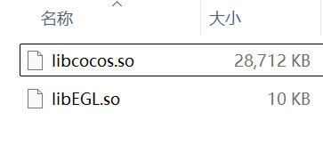
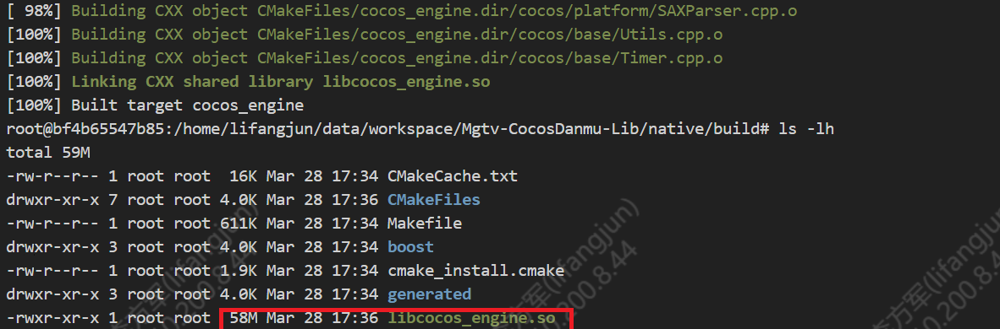
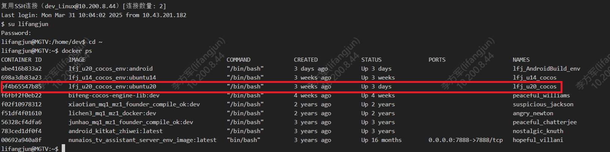
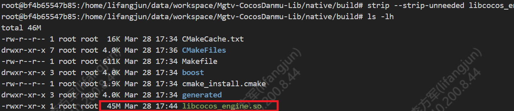
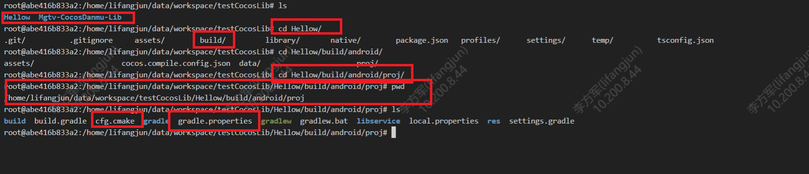
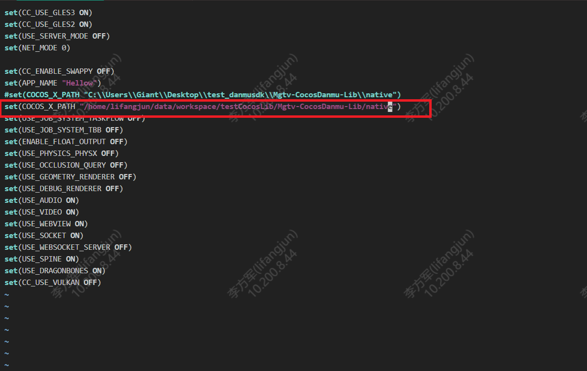
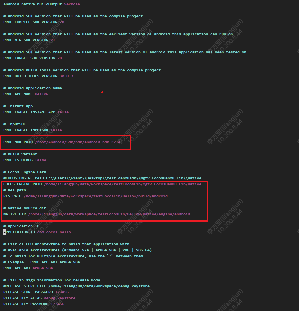
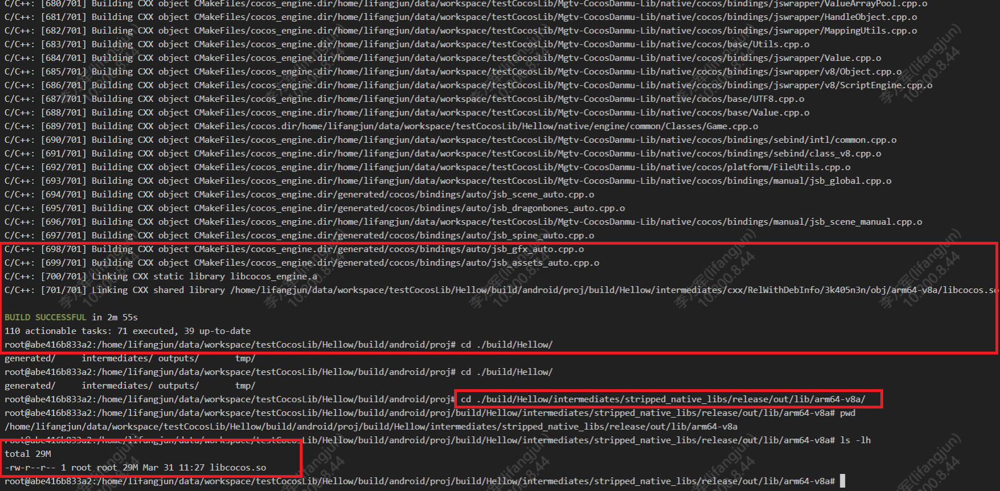

# 服务器Docker编译优化cocos引擎so库的方法


# 一、前言

目前已经实现在8.44的服务器中使用Docker编译Mgtv-CocosDanmu-Lib生成so库（ 具体步骤，详见[服务器Docker编译cocos引擎lib源码](https://wiki.imgo.tv/pages/viewpage.action?pageId=102885891) ）。但是由于编译器、优化级别、目标架构和构建系统配置的不同，通过本地Android Studio 和 服务器Docker CMake 构建的 so 文件大小差异较大。通过本地的Android Studio 编译的so包大小为29M，而通过Docker编译生成的so包为58M。现尝试对Docker中的编译进行优化，压缩so包的体积。

| 本地的Android Studio编译so包   | Ubuntu Docker编译so包          |
| ------------------------------ | ------------------------------ |
|  |  |


## 二、Cmake编译优化

使用的docker 镜像为 lfj_u20_cocos_env:ubuntu20 ，运行的dockers为lfj_u20_cocos。



Android Studio 和 Ubuntu 的 CMake 可能使用了不同的编译选项。Android Studio 可能默认开启了一些优化选项，像 -Oz 或 -Os 这样的优化选项，它们会让代码大小最小化；而 Ubuntu 里的 CMake 或许使用了默认的 -O3 选项，这一选项主要对性能进行优化，而非代码大小。

2.1 修改Cmakelists.txt ，针对 Release 模式的优化

```
set(CMAKE_BUILD_TYPE Release) # 设置 C 编译器为 Clang，这是 Android NDK 工具链中推荐的编译器路径 set(CMAKE_C_COMPILER /root/Android/Sdk/ndk/android-ndk-r21e/toolchains/llvm/prebuilt/linux-x86_64/bin/clang) # 设置 C++ 编译器为 Clang++，支持现代 C++ 标准（如 C++11、C++17） set(CMAKE_CXX_COMPILER /root/Android/Sdk/ndk/android-ndk-r21e/toolchains/llvm/prebuilt/linux-x86_64/bin/clang++) # 为 Release 构建模式设置 C++ 编译选项： # -Os：优化代码大小，减少二进制文件体积，同时保留性能优化 # -g0：完全禁用调试信息，进一步减小输出文件大小 # -ffunction-sections 和 -fdata-sections：将函数和数据放入独立的节，便于链接器移除未使用的部分 set(CMAKE_CXX_FLAGS_RELEASE "${CMAKE_CXX_FLAGS_RELEASE} -Os -g0 -ffunction-sections -fdata-sections") # 为 Release 构建模式的可执行文件设置链接器选项： # -Wl,--gc-sections：链接器选项，移除未使用的代码和数据节，与 -ffunction-sections 配合使用 set(CMAKE_EXE_LINKER_FLAGS_RELEASE "${CMAKE_EXE_LINKER_FLAGS_RELEASE} -Wl,--gc-sections") 
```

- **适用范围**：
  - 仅在 **Release** 构建模式下生效。
  - `CMAKE_CXX_FLAGS_RELEASE` 用于配置 C++ 编译器的 Release 模式选项。
  - `CMAKE_EXE_LINKER_FLAGS_RELEASE` 用于设置可执行文件的链接器选项，仅影响 Release 模式下的链接阶段。
- **主要选项**：
  - `-Os`：优化代码大小，同时保留一定的性能优化（比 `-O3` 更注重减少文件大小）。
  - `-g0`：完全移除调试信息，适用于发布版本。
  - `-ffunction-sections` 和 `-fdata-sections`：将每个函数和数据放入独立的节，以便链接器移除未使用的代码和数据。
  - `-Wl,--gc-sections`：链接器选项，移除未使用的函数和数据节，从而进一步减小生成的二进制文件大小。

2.2 在Build文件夹下运行以下代码构建项目

cmake -DCMAKE_C_COMPILER=/root/Android/Sdk/ndk/android-ndk-r21e/toolchains/llvm/prebuilt/linux-x86_64/bin/clang -DCMAKE_CXX_COMPILER=/root/Android/Sdk/ndk/android-ndk-r21e/toolchains/llvm/prebuilt/linux-x86_64/bin/clang++ -DCMAKE_BUILD_TYPE=Release ..

2.3 生成so库之后，使用 GNU 的 strip 工具优化共享库文件

strip --strip-unneeded libcocos_engine.so




## 三、通过Gradle 编译优化

Ubuntu Docker中直接使用Cmake 对lib源码进行编译的时候，由于编译器、优化级别、目标架构和构建系统配置的不同，编译出来的So文件与本地Windows 编译的so文件大小差别较大。现尝试在Docker 中通过Gradle，复用Cocos 官方示例项目的配置来编译so文件。

3.1 将本地能够成功编译so文件的Android Studio的项目打包（本次使用Cocos 官方示例的HelloWorld 项目），然后根据项目的相关配置文件安装Android 依赖，最终得到可用Gradle 编译的Docker 容器 lfj_AndroidBuild_env ，镜像名为lfj_u20_cocos_env:android 。

3.2 将打包的HelloWorld 项目放入lfj_AndroidBuild_env 容器的挂载项目/home/lifangjun/data/workspace/，再通过docker attach lfj_AndroidBuild_env 进入Docker ，新建文件夹testCocosLib，将压缩包解压至此，同时下载 Mgtv-CocosDanmu-Lib源码。



3.3进入/Hellow/build/android/proj文件夹，将cfg.cmake 和 gradle.properties 这两个文件的路径参数指定为自己的项目的路径。

**cfg.cmake：**

**COCOS_X_PATH** 为编译时Cocos C++ 引擎的路径，本示例为/home/lifangjun/data/workspace/testCocosLib/Mgtv-CocosDanmu-Lib/native



**gradle.properties：**

**PROP_NDK_PATH**为编译需要的NDK工具路径

**COCOS_ENGINE_PATH** 为编译时Cocos C++ 引擎的路径，本示例为/home/lifangjun/data/workspace/testCocosLib/Mgtv-CocosDanmu-Lib/native

**RES_PATH**为Cocos Creator导出的项目路径，cocos 会根据该路径找到pro文件夹，在该路径下构建build 文件夹，即pro文件夹的路径，本示例为/home/lifangjun/data/workspace/testCocosLib/Hellow/build/android/

**NATIVE_DIR** 为Cocoas 创建的app 框架文件路径，本示例为/home/lifangjun/data/workspace/testCocosLib/Hellow/native/engine/android



修改好路径之后，可以在pro文件夹下运行./gradlew assembleRelease 命令，编译项目。最终得到的so文件与Windows 本地编译的大小差不多，为**29M，与本地编译的so文件大小几乎一致**。

